# Wiki Documentation for https://github.com/foobar-ai/openclaw-docker

Generated on: 2026-02-14 07:07:15

## Table of Contents

- [项目简介与快速开始](#page-1)
- [仓库结构与关键文件索引](#page-2)
- [系统架构总览（含架构图）](#page-3)
- [核心功能清单与能力边界](#page-4)
- [数据与消息流（含流程图）](#page-5)
- [容器启动与初始化机制（init.sh）](#page-6)
- [模型对接与协议配置（OpenAI/Claude）](#page-7)
- [部署指南（Docker Compose / Docker Run）](#page-8)
- [镜像构建与发布流水线（CI/CD）](#page-9)
- [扩展与自定义：插件、配置文件与运行用户](#page-10)
- [前端组件说明（适用性与边界）](#page-11)

<a id='page-1'></a>

## 项目简介与快速开始

### Related Pages

Related topics: [部署指南（Docker Compose / Docker Run）](#page-8), [模型对接与协议配置（OpenAI/Claude）](#page-7), [容器启动与初始化机制（init.sh）](#page-6)

<details>
<summary>Relevant source files</summary>

- [README.md](https://github.com/foobar-ai/openclaw-docker/blob/main/README.md)
- [docker-compose.yml](https://github.com/foobar-ai/openclaw-docker/blob/main/docker-compose.yml)
- [.env.example](https://github.com/foobar-ai/openclaw-docker/blob/main/.env.example)
- [version.txt](https://github.com/foobar-ai/openclaw-docker/blob/main/version.txt)
- [LICENSE](https://github.com/foobar-ai/openclaw-docker/blob/main/LICENSE)
</details>

# 项目简介与快速开始

本项目提供一个面向中国主流 IM（飞书、钉钉、QQ 机器人、企业微信等）的 OpenClaw Docker 部署镜像与编排示例，目标是通过环境变量快速完成模型与通道配置，并以网关（Gateway）方式对外提供服务。Sources: [README.md](), [docker-compose.yml:1-43]()

项目默认以 Docker Compose 启动单一服务容器 `openclaw-gateway`，映射两个端口（Gateway/Bridge），并通过挂载卷持久化 OpenClaw 配置与工作空间目录；首次启动时若配置文件不存在，会自动生成配置。Sources: [README.md](), [docker-compose.yml:1-43]()

---

## 1. 快速开始（最小可用路径）

### 1.1 获取编排与环境变量模板

- 下载 `docker-compose.yml`
- 下载 `.env.example` 并复制为 `.env`，至少填写模型相关变量后启动服务。Sources: [README.md](), [.env.example]()

### 1.2 启动与运维命令

常用命令（与文档一致）：

- 启动：`docker-compose up -d`
- 看日志：`docker-compose logs -f`
- 停止：`docker-compose down`
- 进入容器：`docker compose exec openclaw-gateway /bin/bash` Sources: [README.md]()

### 1.3 运行方式概览（数据流/控制流）

下图概览从编辑环境变量到容器启动、配置生成、网关启动与对外端口暴露的主流程。Sources: [README.md](), [docker-compose.yml:1-43]()

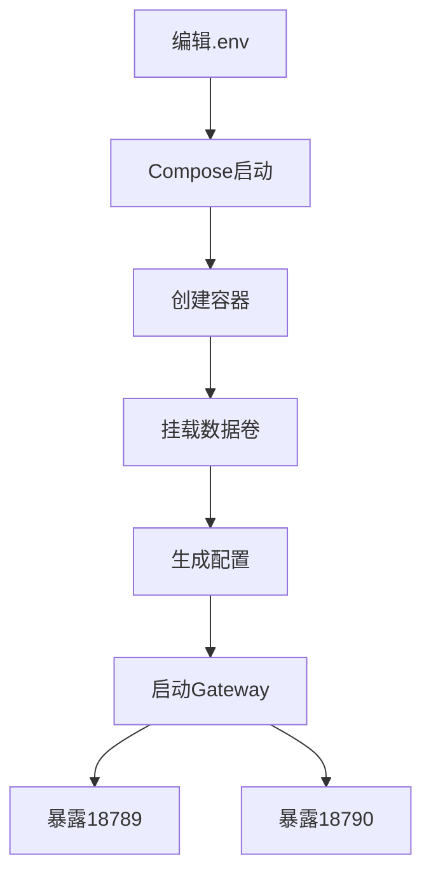

---

## 2. 核心组件与端口

### 2.1 容器内服务与启动模式

项目以 `openclaw gateway --verbose` 方式启动网关服务，并在启动阶段执行初始化流程（创建目录、生成配置、修复权限等）。Sources: [README.md]()

### 2.2 端口定义

| 端口 | 用途 |
|---:|---|
| 18789 | OpenClaw Gateway |
| 18790 | OpenClaw Bridge |  

Sources: [README.md](), [docker-compose.yml:35-37]()

---

## 3. Docker Compose 编排说明（openclaw-gateway）

### 3.1 服务定义要点

`docker-compose.yml` 仅定义一个服务 `openclaw-gateway`，包含镜像、capabilities、运行用户、环境变量、卷与端口映射、重启策略等。Sources: [docker-compose.yml:1-43]()

```yaml
services:
  openclaw-gateway:
    container_name: openclaw-gateway
    image: ${OPENCLAW_IMAGE}
    cap_add:
      - CHOWN
      - SETUID
      - SETGID
      - DAC_OVERRIDE
    user: ${OPENCLAW_RUN_USER:-0:0}
```

Sources: [docker-compose.yml:1-15]()

### 3.2 权限与用户（解决挂载卷写入问题）

- Compose 允许通过 `OPENCLAW_RUN_USER` 指定容器运行 UID:GID；默认以 `0:0` 启动，便于初始化阶段修复挂载目录权限后再降权运行。Sources: [docker-compose.yml:11-15](), [README.md]()

### 3.3 持久化卷与“排除 extensions 目录”的策略

| 挂载项 | 容器路径 | 目的 |
|---|---|---|
| `${OPENCLAW_DATA_DIR}` | `/home/node/.openclaw` | 持久化 OpenClaw 配置与数据 |
| 匿名卷 | `/home/node/.openclaw/extensions` | 排除宿主机 extensions，使用镜像内预装插件 |

Sources: [docker-compose.yml:32-35](), [README.md]()

### 3.4 端口映射

Compose 将宿主机端口 `${OPENCLAW_GATEWAY_PORT}` 与 `${OPENCLAW_BRIDGE_PORT}` 映射到容器内固定端口 `18789`、`18790`。Sources: [docker-compose.yml:35-37]()

---

## 4. 环境变量与配置生成（从 .env 到 openclaw.json）

### 4.1 配置生成行为与覆盖规则

- 容器首次启动时：若 `/home/node/.openclaw/openclaw.json` 不存在，会根据环境变量自动生成配置文件。
- 若宿主机已提供并挂载了该配置文件，则会跳过自动生成。Sources: [README.md]()

### 4.2 模型（Provider）配置变量

下表总结文档给出的关键模型配置项（通过环境变量注入容器，并用于生成配置）。Sources: [README.md](), [docker-compose.yml:16-25](), [.env.example]()

| 环境变量 | 含义 | 文档默认/示例 |
|---|---|---|
| `MODEL_ID` | 模型名称 | 示例：`gpt-4` / `gemini-3-flash-preview` / `claude-sonnet-4-5` |
| `BASE_URL` | Provider Base URL | OpenAI 协议常见以 `/v1` 结尾 |
| `API_KEY` | Provider API Key | `sk-xxx...`/自定义 |
| `API_PROTOCOL` | 协议类型 | `openai-completions` / `anthropic-messages` |
| `CONTEXT_WINDOW` | 上下文窗口 | 示例：`200000`/`1000000` |
| `MAX_TOKENS` | 最大输出 tokens | 示例：`8192` |

### 4.3 协议差异（OpenAI vs Claude）

- `openai-completions`：用于 OpenAI、Gemini 等；Base URL 需要 `/v1` 后缀。
- `anthropic-messages`：用于 Claude；Base URL 不需要 `/v1` 后缀；文档提到具备 Prompt Caching 与 Extended Thinking 特性。Sources: [README.md]()

对应示例（文档原意）：

```bash
# OpenAI 协议（示例）
API_PROTOCOL=openai-completions
BASE_URL=http://localhost:3000/v1

# Claude 协议（示例）
API_PROTOCOL=anthropic-messages
BASE_URL=http://localhost:3000
```

Sources: [README.md]()

---

## 5. 通道（IM 平台）启用与变量注入

Compose 将各通道相关的凭证以环境变量方式注入容器；是否启用对应通道取决于是否提供相关变量并在生成配置时启用相应插件/通道配置。Sources: [README.md](), [docker-compose.yml:26-31](), [.env.example]()

### 5.1 通道环境变量一览

| 平台 | 环境变量 |
|---|---|
| Telegram | `TELEGRAM_BOT_TOKEN` |
| 飞书 | `FEISHU_APP_ID`, `FEISHU_APP_SECRET` |
| 钉钉 | `DINGTALK_CLIENT_ID`, `DINGTALK_CLIENT_SECRET`, `DINGTALK_ROBOT_CODE`, `DINGTALK_CORP_ID`, `DINGTALK_AGENT_ID` |
| QQ 机器人 | `QQBOT_APP_ID`, `QQBOT_CLIENT_SECRET` |
| 企业微信 | `WECOM_TOKEN`, `WECOM_ENCODING_AES_KEY` |

Sources: [docker-compose.yml:26-31](), [README.md]()

### 5.2 飞书关键配置提醒（收不到消息的常见原因）

文档明确指出：若机器人“能发消息但收不到消息”，优先检查事件订阅配置，推荐选择“使用长连接接收事件”，并订阅 `im.message.receive_v1` 等事件。Sources: [README.md]()

### 5.3 Telegram 配对审批（启用后必做）

文档说明：启用 Telegram 需要提供有效 `TELEGRAM_BOT_TOKEN`，并执行配对审批命令：

- `openclaw pairing approve telegram {token}`

随后需要重启 Docker 服务使配置生效。Sources: [README.md]()

---

## 6. Gateway/Bridge 与工作空间配置

### 6.1 Gateway/Bridge 相关变量

| 环境变量 | 含义 | 文档默认/示例 |
|---|---|---|
| `OPENCLAW_GATEWAY_TOKEN` | 网关访问令牌 | 示例：`123456` |
| `OPENCLAW_GATEWAY_BIND` | 绑定地址 | 示例：`lan` |
| `OPENCLAW_GATEWAY_PORT` | Gateway 端口（宿主机侧） | 示例：`18789` |
| `OPENCLAW_BRIDGE_PORT` | Bridge 端口（宿主机侧） | 示例：`18790` |

Sources: [README.md](), [docker-compose.yml:16-25,35-37](), [.env.example]()

### 6.2 工作空间变量

- `WORKSPACE`：工作空间目录（文档默认：`/home/node/.openclaw/workspace`）。Sources: [README.md](), [docker-compose.yml:16-25](), [.env.example]()

---

## 7. “修改环境变量不生效”的处理方式

文档给出规则：容器仅在配置文件不存在时才会生成新配置；若想让新环境变量生效，需要删除现有配置文件或数据目录并重启/重建。Sources: [README.md]()

可选操作路径（文档原意）：

- 删除 `~/.openclaw/openclaw.json` 后重启
- 或删除整个 `~/.openclaw` 目录后重新启动

Sources: [README.md]()

---

## 8. 版本与许可证

### 8.1 版本标记

仓库包含 `version.txt`，当前内容为：

- `2026.2.6-3` Sources: [version.txt:1]()

### 8.2 许可证

文档声明项目遵循 GNU General Public License v3.0（GPL-3.0），并指向 `LICENSE` 文件。Sources: [README.md](), [LICENSE]()

---

## 9. Mermaid：端到端启动时序（精简）

下图以“编辑配置→启动容器→生成配置→启动网关→对外服务”为主线描述交互顺序。Sources: [README.md](), [docker-compose.yml:1-43]()

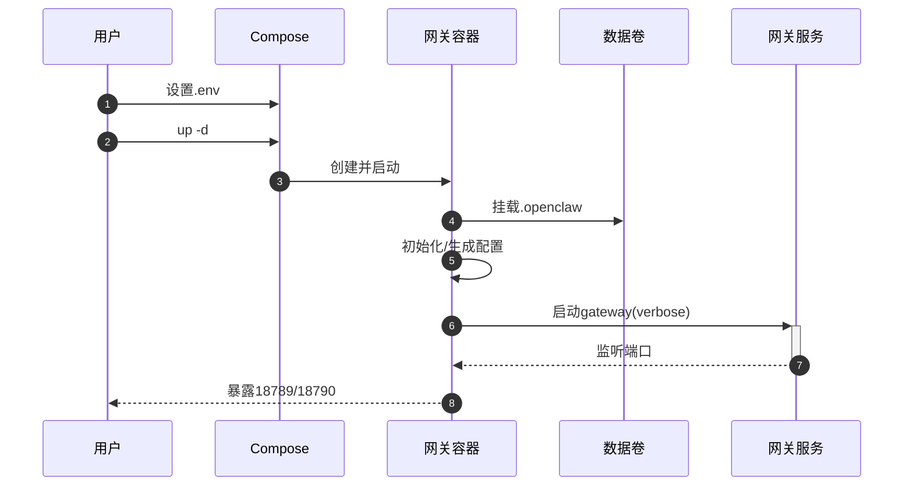

---

## 总结

本页覆盖了项目的部署目标、最小启动流程、Compose 编排结构、端口与持久化策略、模型/通道/Gateway 的关键环境变量，以及“配置不生效”的常见处理方式；这些要点共同构成了从 `.env` 到容器网关可用的完整快速开始路径。Sources: [README.md](), [docker-compose.yml:1-43](), [.env.example](), [version.txt:1]()

---

<a id='page-2'></a>

## 仓库结构与关键文件索引

### Related Pages

Related topics: [系统架构总览（含架构图）](#page-3), [部署指南（Docker Compose / Docker Run）](#page-8), [镜像构建与发布流水线（CI/CD）](#page-9)

<details>
<summary>Relevant source files</summary>

The following files were used as context for generating this wiki page:

- [README.md](https://github.com/foobar-ai/openclaw-docker/blob/main/README.md)
- [Dockerfile](https://github.com/foobar-ai/openclaw-docker/blob/main/Dockerfile)
- [init.sh](https://github.com/foobar-ai/openclaw-docker/blob/main/init.sh)
- [docker-compose.yml](https://github.com/foobar-ai/openclaw-docker/blob/main/docker-compose.yml)
- [.env.example](https://github.com/foobar-ai/openclaw-docker/blob/main/.env.example)
- [openclaw.json.example](https://github.com/foobar-ai/openclaw-docker/blob/main/openclaw.json.example)
- [.github/workflows/README.md](https://github.com/foobar-ai/openclaw-docker/blob/main/.github/workflows/README.md)
- [.github/workflows/docker-build-push.yml](https://github.com/foobar-ai/openclaw-docker/blob/main/.github/workflows/docker-build-push.yml)
- [version.txt](https://github.com/foobar-ai/openclaw-docker/blob/main/version.txt)

</details>

# 仓库结构与关键文件索引

本仓库提供一个面向 OpenClaw Gateway 的 Docker 化部署载体，强调“开箱即用”的中国 IM 插件整合、通过环境变量生成配置、以及数据持久化与权限自修复的容器启动流程。Sources: [README.md:1-220](), [docker-compose.yml:1-41](), [init.sh:1-220]()

本文聚焦“仓库结构与关键文件索引”：梳理代码与配置文件在运行链路中的职责分工、关键配置入口、以及镜像构建/启动/发布的文件边界，便于二次开发与排障。Sources: [README.md:160-220](), [Dockerfile:1-220](), [.github/workflows/docker-build-push.yml:1-220]()

---

## 仓库结构总览（按运行链路）

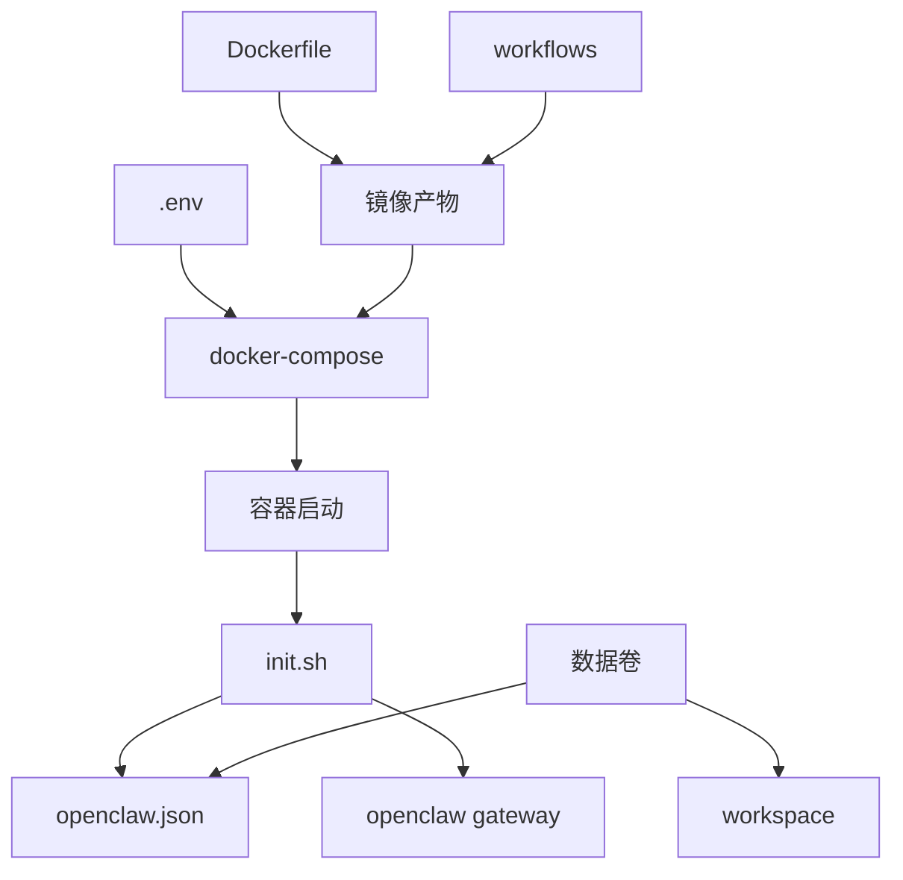

- `.env`/环境变量通过 `docker-compose.yml` 注入容器，驱动 `init.sh` 在首次启动时生成 `openclaw.json`，并最终启动 `openclaw gateway --verbose`。Sources: [README.md:1-120](), [README.md:160-220](), [docker-compose.yml:1-41](), [init.sh:1-220]()
- `Dockerfile` 定义镜像内预装的 OpenClaw 主程序与插件依赖，GitHub Actions 工作流用于构建/推送镜像。Sources: [README.md:200-220](), [Dockerfile:1-220](), [.github/workflows/docker-build-push.yml:1-220]()

---

## 关键文件索引（用途与边界）

| 文件 | 类型 | 运行阶段 | 核心职责 |
|---|---|---|---|
| `README.md` | 文档 | 使用/运维 | 说明环境变量、协议选择、端口/卷、权限问题与排障、已预装插件清单与启动命令 |
| `docker-compose.yml` | 编排 | 运行 | 定义容器能力(cap_add)、运行用户、环境变量注入、卷与端口映射、重启策略 |
| `init.sh` | 入口脚本 | 启动 | 创建目录、生成/复用配置文件、修复挂载卷权限、启动网关（verbose） |
| `Dockerfile` | 构建 | 构建 | 构建运行镜像、安装 openclaw 与插件等依赖 |
| `.env.example` | 模板 | 配置 | 提供最小/常用环境变量样例（模型、协议、IM 凭证、网关端口等） |
| `openclaw.json.example` | 示例 | 配置 | 给出 OpenClaw 默认配置结构参考（首次启动生成逻辑的目标形态） |
| `.github/workflows/docker-build-push.yml` | CI | 发布 | 自动化构建/推送 Docker 镜像 |
| `.github/workflows/README.md` | 文档 | 发布 | 说明工作流使用方式/约定 |
| `version.txt` | 版本 | 发布 | 记录仓库/镜像版本标识 |
Sources: [README.md:160-220](), [docker-compose.yml:1-41](), [init.sh:1-220](), [Dockerfile:1-220](), [.env.example:1-220](), [openclaw.json.example:1-220](), [.github/workflows/docker-build-push.yml:1-220](), [.github/workflows/README.md:1-220](), [version.txt:1]()

---

## docker-compose.yml：运行编排入口

### 服务定义与容器能力

`openclaw-gateway` 服务通过 `cap_add` 赋予权限相关能力，并允许通过 `OPENCLAW_RUN_USER` 控制容器运行的 UID/GID；默认以 `0:0` 启动以便 `init.sh` 先修复挂载卷权限再降权运行。Sources: [docker-compose.yml:1-18](), [README.md:120-170]()

```yaml
services:
  openclaw-gateway:
    cap_add:
      - CHOWN
      - SETUID
      - SETGID
      - DAC_OVERRIDE
    user: ${OPENCLAW_RUN_USER:-0:0}
```
Sources: [docker-compose.yml:1-18]()

### 环境变量注入矩阵

编排文件将模型相关参数、IM 通道凭证、工作空间、网关端口与 Token 等注入容器环境，供初始化脚本生成配置并驱动运行。Sources: [docker-compose.yml:18-41](), [README.md:1-120](), [.env.example:1-220]()

| 分组 | 变量（示例） | 作用 |
|---|---|---|
| 模型 | `MODEL_ID` / `BASE_URL` / `API_KEY` / `API_PROTOCOL` / `CONTEXT_WINDOW` / `MAX_TOKENS` | 选择后端模型与协议，并控制上下文与最大输出 |
| 通道 | `TELEGRAM_BOT_TOKEN` / `FEISHU_*` / `DINGTALK_*` / `QQBOT_*` / `WECOM_*` | 按需启用各 IM 平台插件/通道 |
| 网关 | `OPENCLAW_GATEWAY_TOKEN` / `OPENCLAW_GATEWAY_BIND` / `OPENCLAW_GATEWAY_PORT` / `OPENCLAW_BRIDGE_PORT` | 网关鉴权、绑定地址与端口 |
| 工作空间 | `WORKSPACE` | 指定工作目录位置（与持久化卷配合） |
Sources: [docker-compose.yml:18-41](), [README.md:1-120](), [README.md:70-110](), [.env.example:1-220]()

### 卷与端口映射

- 将 `${OPENCLAW_DATA_DIR}` 映射到 `/home/node/.openclaw` 做配置与数据持久化。
- 使用匿名卷排除 `extensions` 目录，以使用镜像内预装插件，而非宿主机覆盖。
- 将宿主机端口 `${OPENCLAW_GATEWAY_PORT}` / `${OPENCLAW_BRIDGE_PORT}` 映射到容器内固定端口 `18789` / `18790`。Sources: [docker-compose.yml:33-40](), [README.md:40-70]()

```mermaid
graph TD
  A[宿主机端口] --> B[18789]
  A --> C[18790]
  D[OPENCLAW_DATA_DIR] --> E[/home/node/.openclaw]
  F[匿名卷] --> G[extensions]
```
Sources: [docker-compose.yml:33-40](), [README.md:40-70]()

---

## init.sh：容器启动主流程（目录/配置/权限/启动）

初始化脚本作为容器主程序运行，负责目录结构准备、在配置文件不存在时按环境变量生成配置、修正文件权限，并以 verbose 模式启动 OpenClaw Gateway。Sources: [README.md:180-220](), [init.sh:1-220]()

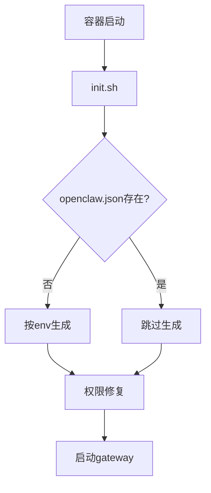
Sources: [README.md:180-220](), [README.md:60-70](), [init.sh:1-220]()

### 配置生成触发条件与覆盖策略

- 仅当 `/home/node/.openclaw/openclaw.json` 不存在时才会生成；若宿主机已挂载并预先创建该文件，则容器启动会跳过自动生成。Sources: [README.md:60-70](), [README.md:90-110](), [init.sh:1-220]()

### 权限问题与运行用户策略

仓库文档描述了“偶发 Permission denied”的成因：宿主机挂载目录的 UID/GID 可能与容器内运行用户不一致；并提供 `chown` 修复与通过 `OPENCLAW_RUN_USER` 显式指定运行用户的方式。Sources: [README.md:120-170](), [docker-compose.yml:10-18](), [init.sh:1-220]()

```mermaid
sequenceDiagram
  autonumber
  participant U as 用户
  participant DC as docker-compose
  participant C as 容器
  participant I as init.sh
  participant FS as 挂载卷
  participant G as gateway

  U->>DC: up -d
  DC->>C: 创建并启动
  C->>+I: 执行入口脚本
  I->>FS: 检测可写/归属
  alt 归属不匹配
    I->>FS: 尝试修复权限
    I-->>FS: 修复完成/失败
  else 已可写
    I-->>FS: 无需修复
  end
  I->>G: openclaw gateway --verbose
  G-->>-I: 进入运行态
```
Sources: [README.md:120-170](), [README.md:210-220](), [docker-compose.yml:10-18](), [init.sh:1-220]()

---

## Dockerfile：镜像构建与预装能力

镜像中预装并全局安装 OpenClaw 主程序、OpenCode AI、Playwright，以及多种中国 IM 平台插件（飞书、钉钉、QQ 机器人、企业微信等）。Sources: [README.md:200-220](), [Dockerfile:1-220]()

### 预装组件清单（按文档口径）

| 类别 | 组件 | 说明 |
|---|---|---|
| 主程序 | `openclaw@latest` | OpenClaw 主程序 |
| 工具 | `opencode-ai@latest` | OpenCode AI |
| 自动化 | `playwright` | 浏览器自动化 |
| IM 插件 | `@m1heng-clawd/feishu` | 飞书插件（GitHub 安装） |
| IM 插件 | `clawdbot-channel-dingtalk` | 钉钉插件（GitHub 安装） |
| IM 插件 | `qqbot` | QQ 机器人（先克隆后本地安装） |
| IM 插件 | `openclaw-plugin-wecom` | 企业微信插件（GitHub 安装） |
Sources: [README.md:200-220](), [Dockerfile:1-220]()

---

## .env.example：环境变量配置入口（建议以此为基线）

`.env` 用于承载最小运行所需的模型配置（`MODEL_ID`/`BASE_URL`/`API_KEY`），以及可选的 IM 凭证与网关参数；仓库提供 `.env.example` 作为模板。Sources: [README.md:1-40](), [README.md:20-35](), [.env.example:1-220]()

### 协议选择要点（影响 Base URL 形态）

| `API_PROTOCOL` | 适用 | Base URL 约束 |
|---|---|---|
| `openai-completions` | OpenAI、Gemini 等 | 需要 `/v1` 后缀 |
| `anthropic-messages` | Claude | 不需要 `/v1` 后缀 |
Sources: [README.md:1-20](), [README.md:30-55](), [.env.example:1-220]()

---

## openclaw.json.example：配置文件形态与生成目标

仓库说明首次启动时会在配置文件不存在的情况下自动生成 `openclaw.json`，其内容覆盖模型配置、通道配置、网关配置与插件启用等；`openclaw.json.example` 用作默认配置示例与参考。Sources: [README.md:180-205](), [openclaw.json.example:1-220](), [init.sh:1-220]()

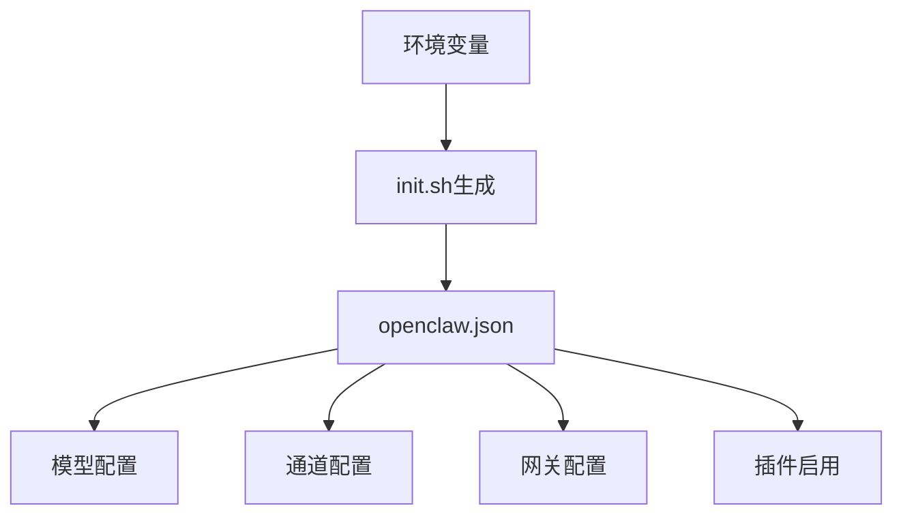
Sources: [README.md:180-205](), [openclaw.json.example:1-220](), [init.sh:1-220]()

---

## GitHub Actions：构建与发布文件边界（工作流目录）

仓库包含 `.github/workflows/docker-build-push.yml` 与配套说明文档，用于镜像构建/推送的自动化流程管理。Sources: [.github/workflows/docker-build-push.yml:1-220](), [.github/workflows/README.md:1-220]()

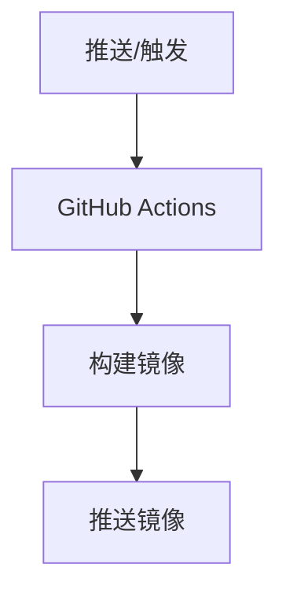
Sources: [.github/workflows/docker-build-push.yml:1-220](), [.github/workflows/README.md:1-220]()

---

## version.txt：版本标识

`version.txt` 记录了当前版本号字符串（用于发布/追踪）。Sources: [version.txt:1]()

---

## 常用运维定位：从文件到现象的映射

| 现象 | 首查文件 | 关联点 |
|---|---|---|
| 环境变量改了不生效 | `init.sh` / `README.md` | 仅在 `openclaw.json` 不存在时才生成；需删除配置再重启 |
| 端口不通/冲突 | `docker-compose.yml` / `README.md` | 18789/18790 映射与宿主端口占用 |
| Permission denied 偶发 | `docker-compose.yml` / `README.md` / `init.sh` | 挂载卷 UID/GID 不一致；可 `chown` 或设置 `OPENCLAW_RUN_USER` |
| 插件未按预期加载 | `docker-compose.yml` / `Dockerfile` / `README.md` | `extensions` 使用匿名卷，优先镜像预装插件 |
Sources: [README.md:90-120](), [README.md:40-70](), [README.md:120-170](), [docker-compose.yml:10-18](), [docker-compose.yml:33-36](), [init.sh:1-220](), [Dockerfile:1-220]()

---

## 总结

仓库以“环境变量 → 编排注入 → 初始化脚本生成配置/修复权限 → 启动网关”为主线组织文件职责：`docker-compose.yml` 负责运行注入与持久化边界，`init.sh` 负责启动时的配置/权限收敛，`Dockerfile` 负责将 OpenClaw 与中国 IM 插件预装进镜像，工作流文件负责构建发布闭环。Sources: [README.md:160-220](), [docker-compose.yml:1-41](), [init.sh:1-220](), [Dockerfile:1-220](), [.github/workflows/docker-build-push.yml:1-220]()

---

<a id='page-3'></a>

## 系统架构总览（含架构图）

### Related Pages

Related topics: [数据与消息流（含流程图）](#page-5), [容器启动与初始化机制（init.sh）](#page-6), [模型对接与协议配置（OpenAI/Claude）](#page-7), [部署指南（Docker Compose / Docker Run）](#page-8)

<details>
<summary>Relevant source files</summary>

- [README.md](https://github.com/foobar-ai/openclaw-docker/blob/main/README.md)
- [docker-compose.yml](https://github.com/foobar-ai/openclaw-docker/blob/main/docker-compose.yml)
- [Dockerfile](https://github.com/foobar-ai/openclaw-docker/blob/main/Dockerfile)
- [init.sh](https://github.com/foobar-ai/openclaw-docker/blob/main/init.sh)
- [version.txt](https://github.com/foobar-ai/openclaw-docker/blob/main/version.txt)

</details>

# 系统架构总览（含架构图）

本项目提供一个面向中国主流 IM 平台的 OpenClaw Docker 镜像与部署编排：通过环境变量生成/加载 OpenClaw 配置，启动 OpenClaw Gateway，并按需启用飞书、钉钉、QQ 机器人、企业微信等通道插件，将 IM 消息统一接入到后端大模型 Provider（支持 OpenAI 协议与 Claude 协议），用于快速部署多平台机器人网关。  
Sources: [README.md](), [docker-compose.yml]()

项目的运行核心是单容器服务 `openclaw-gateway`：由 `docker-compose.yml` 负责声明容器权限、端口映射、卷挂载与环境变量；由 `init.sh` 作为容器启动入口完成目录创建、配置生成、权限修复，并最终执行 `openclaw gateway --verbose`。  
Sources: [README.md](), [docker-compose.yml](), [init.sh]()

---

## 总体部署架构

### 容器与外部依赖关系

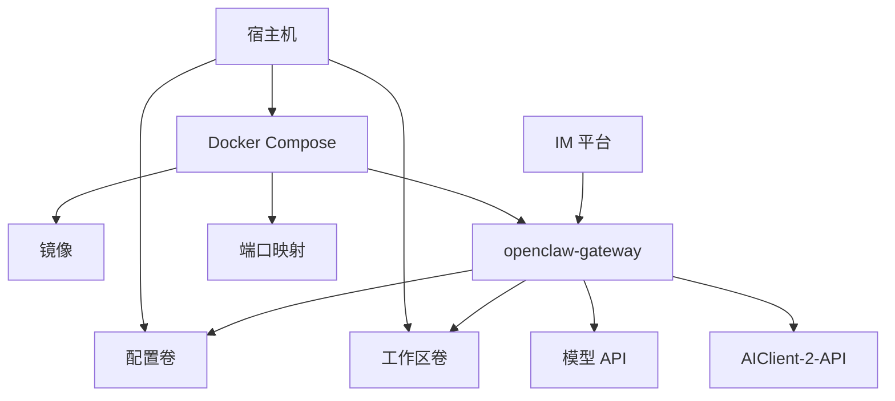

- `docker-compose.yml` 定义单服务 `openclaw-gateway`，通过环境变量注入模型与通道凭证，映射两个端口并挂载数据目录。  
- README 明确推荐与 AIClient-2-API 对接，将各类 AI 客户端转换为标准 API 接口，并支持 OpenAI/Claude 两类协议。  
Sources: [docker-compose.yml](), [README.md]()

---

## 运行时组件拆分

### 1) OpenClaw Gateway（主进程）

- 容器内最终以命令 `openclaw gateway --verbose` 启动 Gateway 服务，并开启详细日志。  
Sources: [README.md]()

- Gateway 相关的运行参数由环境变量提供（令牌、绑定地址、网关/桥接端口）。  
Sources: [README.md](), [docker-compose.yml]()

### 2) 初始化入口（init.sh）

README 描述 `init.sh` 作为容器初始化脚本（主程序运行），负责：创建目录、按环境变量生成配置（若不存在）、设置权限、启动 Gateway。  
Sources: [README.md](), [init.sh]()

### 3) 镜像构建（Dockerfile）

README 列出镜像构建文件 `Dockerfile`，并说明镜像预装了 OpenClaw 主程序、OpenCode AI、Playwright，以及多种中国 IM 平台插件（飞书、钉钉、QQ、企业微信等）。  
Sources: [README.md](), [Dockerfile]()

### 4) 编排入口（docker-compose.yml）

- 服务名：`openclaw-gateway`  
- 镜像：`${OPENCLAW_IMAGE}`  
- 运行用户：`user: ${OPENCLAW_RUN_USER:-0:0}`（默认 root 启动以便修复挂载卷权限，之后再“降权运行网关”的策略在 README 中说明）  
- 权限能力：`CHOWN/SETUID/SETGID/DAC_OVERRIDE`  
- 挂载：`${OPENCLAW_DATA_DIR}:/home/node/.openclaw`，并用匿名卷排除 `/home/node/.openclaw/extensions` 以使用镜像内预装插件  
- 端口：宿主机 `${OPENCLAW_GATEWAY_PORT}` 映射容器 `18789`；宿主机 `${OPENCLAW_BRIDGE_PORT}` 映射容器 `18790`  
Sources: [docker-compose.yml](), [README.md]()

---

## 配置与数据流架构

### 配置来源与优先级

- OpenClaw 配置目录固定在容器内 `/home/node/.openclaw`，建议将宿主机目录挂载到该路径以持久化。  
- 若宿主机已提供 `~/.openclaw/openclaw.json` 并挂载，则容器启动时会检测到已存在配置文件并跳过自动生成；否则由初始化脚本按环境变量生成。  
Sources: [README.md](), [docker-compose.yml](), [init.sh]()

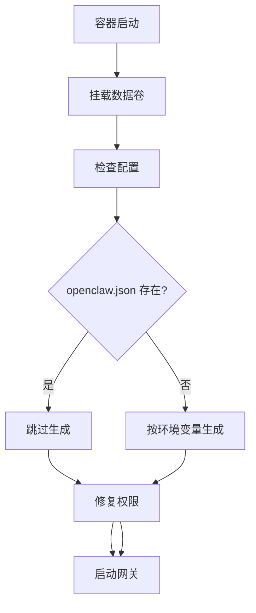

Sources: [README.md](), [docker-compose.yml](), [init.sh]()

### 启动时序（从 Compose 到网关）

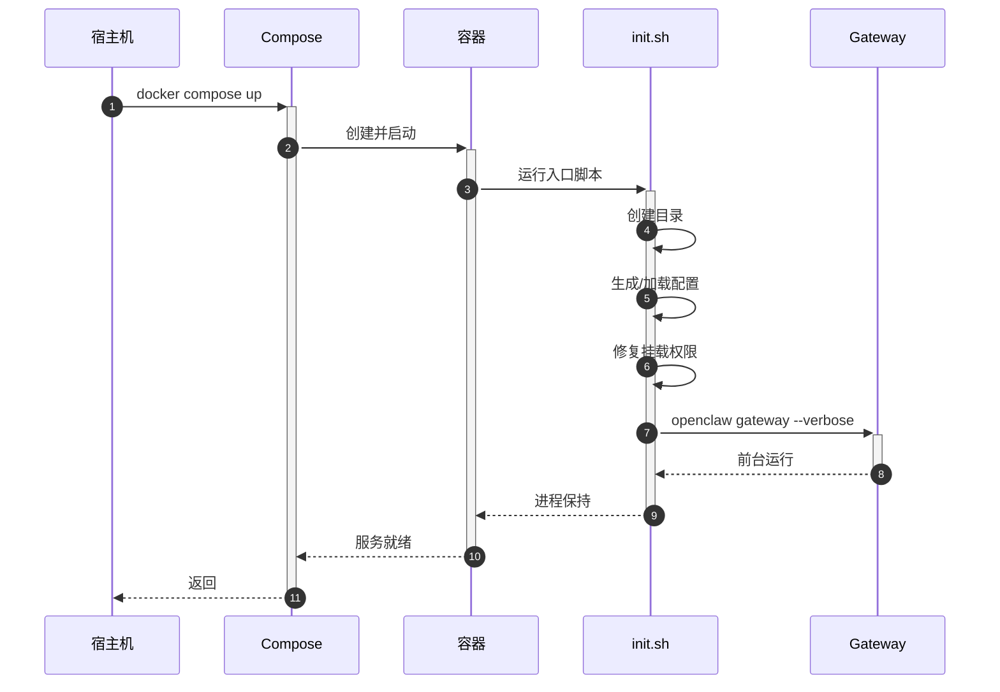

Sources: [README.md](), [docker-compose.yml](), [init.sh]()

---

## 通道（IM 平台）接入架构

### 支持的 IM 平台与启用方式

README 明确支持并预装/集成的中国 IM 平台插件包括：飞书、钉钉、QQ 机器人、企业微信；同时通道配置均通过环境变量提供，未配置的通道可不启用（可选项）。  
Sources: [README.md](), [docker-compose.yml](), [Dockerfile]()

| 平台 | 关键环境变量（示例） | 说明 |
|---|---|---|
| 飞书 | `FEISHU_APP_ID`, `FEISHU_APP_SECRET` | 用于飞书机器人凭证配置 |
| 钉钉 | `DINGTALK_CLIENT_ID`, `DINGTALK_CLIENT_SECRET`, `DINGTALK_ROBOT_CODE`, `DINGTALK_CORP_ID`, `DINGTALK_AGENT_ID` | Stream 模式相关凭证 |
| QQ 机器人 | `QQBOT_APP_ID`, `QQBOT_CLIENT_SECRET` | QQ 开放平台凭证 |
| 企业微信 | `WECOM_TOKEN`, `WECOM_ENCODING_AES_KEY` | 回调验签相关参数 |

Sources: [README.md](), [docker-compose.yml]()

### IM 消息到模型请求的逻辑链路（宏观）

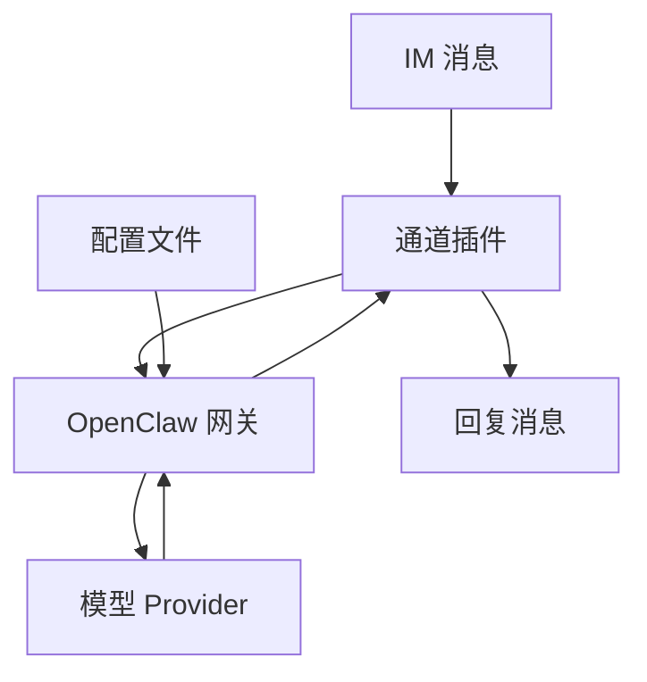

- 网关根据生成/加载的配置（包含模型配置、通道配置、插件启用等）来决定启用哪些通道与使用哪个 Provider。  
Sources: [README.md](), [init.sh]()

---

## 模型 Provider 与协议架构（OpenAI / Claude）

### Provider 关键参数

README 给出模型侧最小配置：`MODEL_ID`、`BASE_URL`、`API_KEY`，并补充协议类型、上下文与最大输出等参数：`API_PROTOCOL`、`CONTEXT_WINDOW`、`MAX_TOKENS`。Compose 将这些参数全部注入容器环境变量。  
Sources: [README.md](), [docker-compose.yml]()

| 参数 | 作用 | 示例/默认（以 README 示例为准） |
|---|---|---|
| `MODEL_ID` | 模型名称 | `gemini-3-flash-preview` / `claude-sonnet-4-5` |
| `BASE_URL` | Provider Base URL | OpenAI 协议常见带 `/v1`；Claude 协议不带 `/v1` |
| `API_KEY` | Provider Key | `your-api-key` |
| `API_PROTOCOL` | 协议类型 | `openai-completions` / `anthropic-messages` |
| `CONTEXT_WINDOW` | 上下文窗口 | 示例：`1000000` / `200000` |
| `MAX_TOKENS` | 最大输出 | 示例：`8192` |

Sources: [README.md](), [docker-compose.yml]()

### 两类协议的 Base URL 规则

README 明确：
- `openai-completions`：Base URL 需要 `/v1` 后缀（示例 `http://localhost:3000/v1`）  
- `anthropic-messages`：Base URL 不需要 `/v1`（示例 `http://localhost:3000`）  
Sources: [README.md]()

### 与 AIClient-2-API 的对接位置

README 提供对接流程与示例配置：先启动 AIClient-2-API 并在其 Web UI 配置 Provider，然后在本项目 `.env` 里将 `BASE_URL` 指向 AIClient-2-API（含可选的“指定特定提供商”路径前缀），从而让 Gateway 经由该服务访问模型。  
Sources: [README.md]()

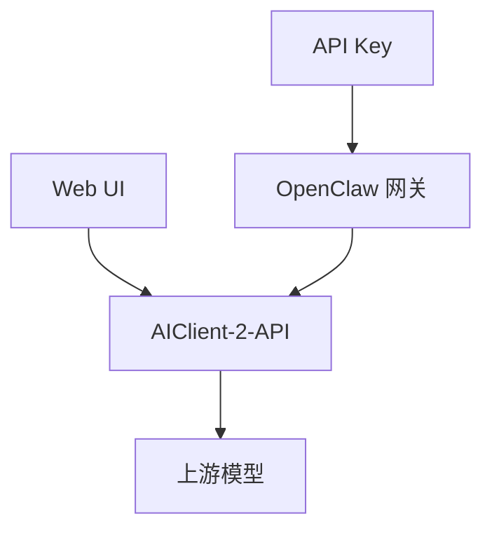

Sources: [README.md]()

---

## 网络与端口架构

README 与 Compose 对端口有一致说明：

- 容器侧固定端口：`18789`（Gateway）、`18790`（Bridge）  
- 宿主机侧端口：由环境变量 `OPENCLAW_GATEWAY_PORT`、`OPENCLAW_BRIDGE_PORT` 决定，并映射到容器固定端口  
Sources: [README.md](), [docker-compose.yml]()

| 端口 | 容器端口 | 宿主机端口 | 用途 |
|---|---:|---:|---|
| Gateway | 18789 | `${OPENCLAW_GATEWAY_PORT}` | 网关服务端口 |
| Bridge | 18790 | `${OPENCLAW_BRIDGE_PORT}` | Bridge 端口 |

Sources: [README.md](), [docker-compose.yml]()

---

## 数据持久化与卷布局

### 卷挂载设计

- 容器使用 `/home/node/.openclaw` 持久化 OpenClaw 配置和数据目录；`/home/node/.openclaw/workspace` 作为工作空间目录（README 说明持久化目录语义；Compose 实际挂载了整个 data dir）。  
- Compose 额外挂载匿名卷到 `/home/node/.openclaw/extensions`，用于“排除 extensions 目录”，从而使用镜像中预装的插件，而不是宿主机 extensions 覆盖。  
Sources: [README.md](), [docker-compose.yml]()

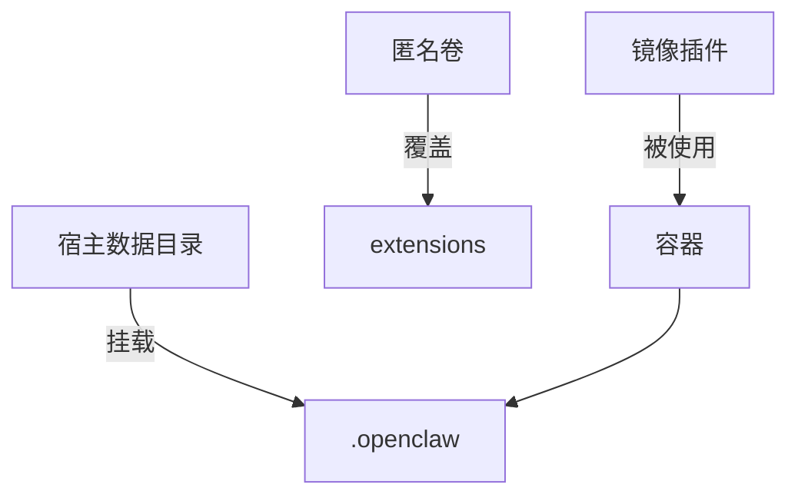

Sources: [docker-compose.yml](), [README.md]()

---

## 权限与运行用户架构（避免 Permission denied）

README 说明“同样启动命令偶发 Permission denied”的根因是：宿主机挂载目录所有者（UID/GID）与容器内运行用户不一致；并给出排查与解决方案（例如 `chown -R 1000:1000 ~/.openclaw`，或通过 `OPENCLAW_RUN_USER=1000:1000` 指定运行用户）。Compose 也提供 `user: ${OPENCLAW_RUN_USER:-0:0}`，默认 root 启动以便 `init.sh` 修复权限后再运行网关。  
Sources: [README.md](), [docker-compose.yml](), [init.sh]()

| 机制/参数 | 位置 | 作用 |
|---|---|---|
| `cap_add: CHOWN/SETUID/SETGID/DAC_OVERRIDE` | Compose | 支撑容器内调整权限/所有权等操作 |
| `OPENCLAW_RUN_USER` | README/Compose | 指定容器运行 UID:GID（可选） |
| 默认 `0:0` 启动 | Compose/README | 先以 root 启动，便于 init 阶段修复挂载卷 |
| 权限修复与失败退出 | README/init.sh | 若仍不可写，输出修复命令并失败退出（避免隐性不稳定） |

Sources: [docker-compose.yml](), [README.md](), [init.sh]()

---

## 关键配置示例（摘录）

### Docker Compose 服务声明（关键字段）

```yaml
services:
  openclaw-gateway:
    image: ${OPENCLAW_IMAGE}
    user: ${OPENCLAW_RUN_USER:-0:0}
    cap_add:
      - CHOWN
      - SETUID
      - SETGID
      - DAC_OVERRIDE
    volumes:
      - ${OPENCLAW_DATA_DIR}:/home/node/.openclaw
      - /home/node/.openclaw/extensions
    ports:
      - "${OPENCLAW_GATEWAY_PORT}:18789"
      - "${OPENCLAW_BRIDGE_PORT}:18790"
```

Sources: [docker-compose.yml]()

### 两类协议的 `.env` 配置片段（README 示例）

```bash
# OpenAI 协议（示例）
API_PROTOCOL=openai-completions
BASE_URL=http://localhost:3000/v1

# Claude 协议（示例）
API_PROTOCOL=anthropic-messages
BASE_URL=http://localhost:3000
```

Sources: [README.md]()

---

## 版本信息

仓库包含 `version.txt` 用于记录版本号（示例：`2026.2.6-3`）。  
Sources: [version.txt]()

---

## 总结

本项目以单容器 `openclaw-gateway` 为核心，通过 Compose 注入模型/通道参数并映射端口、挂载持久化目录；由 `init.sh` 在启动时生成/复用 OpenClaw 配置并修复卷权限；最终启动 OpenClaw Gateway，将来自飞书/钉钉/QQ/企业微信等通道的消息汇聚到统一网关，并通过 OpenAI 或 Claude 协议对接后端模型（可选经由 AIClient-2-API）。  
Sources: [README.md](), [docker-compose.yml](), [init.sh](), [Dockerfile](), [version.txt]()

---

<a id='page-4'></a>

## 核心功能清单与能力边界

### Related Pages

Related topics: [模型对接与协议配置（OpenAI/Claude）](#page-7), [扩展与自定义：插件、配置文件与运行用户](#page-10), [部署指南（Docker Compose / Docker Run）](#page-8)

<details>
<summary>Relevant source files</summary>

- [README.md](https://github.com/foobar-ai/openclaw-docker/blob/main/README.md)
- [docker-compose.yml](https://github.com/foobar-ai/openclaw-docker/blob/main/docker-compose.yml)
- [Dockerfile](https://github.com/foobar-ai/openclaw-docker/blob/main/Dockerfile)
- [.env.example](https://github.com/foobar-ai/openclaw-docker/blob/main/.env.example)
- [version.txt](https://github.com/foobar-ai/openclaw-docker/blob/main/version.txt)
</details>

# 核心功能清单与能力边界

本项目提供一个面向中国主流 IM 平台的 OpenClaw Docker 镜像与一键部署配置，通过 Docker Compose/`docker run` 方式启动 OpenClaw Gateway，并通过环境变量生成（或复用）运行配置，实现“开箱即用”的多渠道机器人网关。Sources: [README.md](), [docker-compose.yml]()

项目的能力边界集中在“容器化封装 + 运行时参数注入 + 插件预装/启用 + 数据卷持久化 + 端口暴露”；不负责替你代办各 IM 平台的应用创建、权限/事件订阅配置与公网可达性等外部前置条件。Sources: [README.md]()

---

## 1. 核心能力清单（What it does）

### 1.1 一键部署 OpenClaw Gateway/Bridge
- 通过 `docker-compose up -d` 启动 `openclaw-gateway` 容器服务，并暴露两个端口：Gateway（默认 18789）与 Bridge（默认 18790）。Sources: [README.md](), [docker-compose.yml]()
- 容器启动入口最终执行 `openclaw gateway --verbose`（以 verbose 模式运行）。Sources: [README.md]()

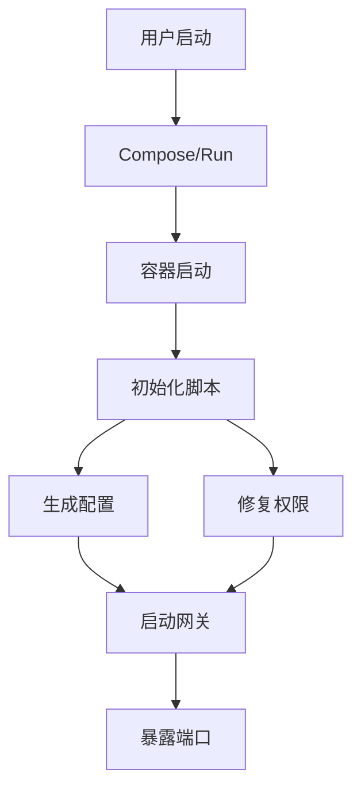

上图描述了从启动容器到初始化、配置生成/权限修复、网关启动与端口对外提供服务的主链路。Sources: [README.md](), [docker-compose.yml]()

---

### 1.2 通过环境变量注入 AI Provider 与模型参数
- 通过环境变量配置后端模型（`MODEL_ID`）、Provider 地址（`BASE_URL`）、密钥（`API_KEY`）、协议（`API_PROTOCOL`）、上下文窗口（`CONTEXT_WINDOW`）与输出上限（`MAX_TOKENS`）。Sources: [README.md](), [docker-compose.yml]()
- 支持两种协议形态：
  - `openai-completions`：要求 `BASE_URL` 带 `/v1` 后缀（推荐用于 Gemini 等）。Sources: [README.md]()
  - `anthropic-messages`：`BASE_URL` 通常不需要 `/v1`（推荐用于 Claude）。Sources: [README.md]()

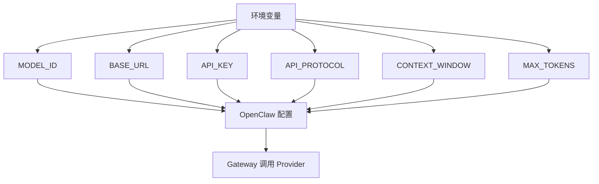

该图强调：本项目以“环境变量 → OpenClaw 配置 → Gateway 调用 Provider”的方式完成 AI 后端接入。Sources: [README.md](), [docker-compose.yml]()

---

### 1.3 预装并整合中国 IM 插件（按环境变量启用）
支持的 IM 平台（按 README 描述）：
- 飞书（Feishu/Lark）
- 钉钉（DingTalk）
- QQ 机器人（QQ Bot）
- 企业微信（WeCom）  
Sources: [README.md]()

对应环境变量在 Compose 中已预留，作为“通道配置”的输入面。Sources: [docker-compose.yml]()

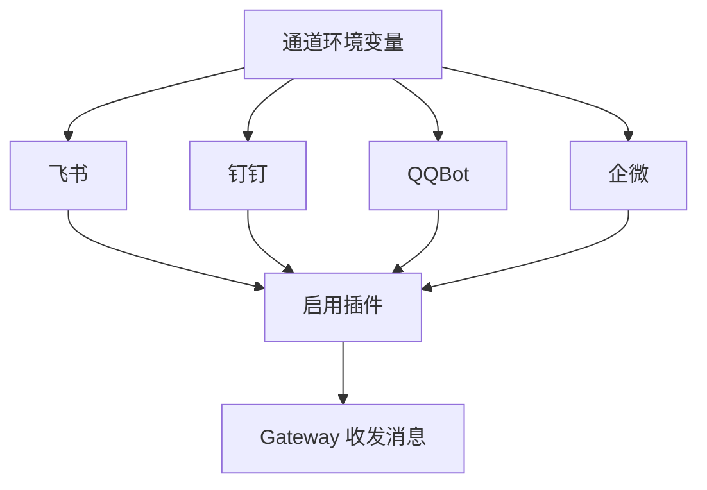

该图表示：不同平台的凭证通过环境变量输入，驱动插件启用，最终由 Gateway 统一对外提供机器人收发能力。Sources: [README.md](), [docker-compose.yml]()

---

### 1.4 数据持久化与工作空间
- 容器持久化目录：
  - `/home/node/.openclaw`：OpenClaw 配置与数据
  - `/home/node/.openclaw/workspace`：工作空间  
  并建议将宿主机目录挂载到容器中。Sources: [README.md]()
- Compose 中将 `${OPENCLAW_DATA_DIR}` 挂载到 `/home/node/.openclaw`；并使用匿名卷覆盖 `/home/node/.openclaw/extensions`，以“排除宿主机 extensions 干扰、优先使用镜像内预装插件”。Sources: [docker-compose.yml]()

```mermaid
flowchart TD
  A[宿主机数据目录] -->|bind mount| B[/home/node/.openclaw]
  B --> C[openclaw.json]
  B --> D[workspace]
  E[匿名卷] --> F[/home/node/.openclaw/extensions]
  F --> G[使用镜像插件]
```

该图体现了两类卷：配置/数据使用宿主机持久化卷，extensions 使用匿名卷以固定插件来源。Sources: [README.md](), [docker-compose.yml]()

---

### 1.5 权限处理与可选运行用户
- Compose 默认使用 `user: ${OPENCLAW_RUN_USER:-0:0}`，并在注释中说明：默认保持 root 启动，便于初始化脚本自动修复挂载卷权限后再降权运行网关；也可显式指定如 `1000:1000`。Sources: [docker-compose.yml](), [README.md]()
- README 描述了常见的 `Permission denied` 成因（宿主机挂载目录 UID/GID 与容器内运行用户不一致），并给出修复方式（例如 `chown -R 1000:1000 ~/.openclaw` 或设置 `OPENCLAW_RUN_USER=1000:1000`）。Sources: [README.md]()

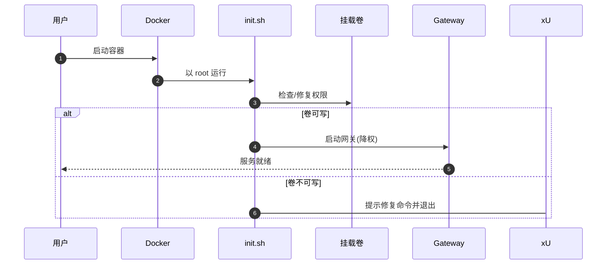

该时序图概括了“root 启动 → 修复卷权限 → 再运行服务/失败退出”的行为边界（以 README 与 Compose 注释为依据）。Sources: [docker-compose.yml](), [README.md]()

---

## 2. 能力边界（What it does NOT do）

### 2.1 不代替 IM 平台侧的外部配置
- 飞书：需要创建应用、开通权限、配置事件订阅（尤其“使用长连接接收事件”与 `im.message.receive_v1` 等）。Sources: [README.md]()
- 钉钉：需要创建企业内部应用、机器人能力、Stream 模式、发布应用并获取各类凭证。Sources: [README.md]()
- QQ：需要在 QQ 开放平台创建机器人并配置 IP 白名单等外部依赖。Sources: [README.md]()
- 企业微信：需要后台创建应用、配置 Token/EncodingAESKey，并将接收消息 URL 指向公网可达地址。Sources: [README.md]()

> 边界总结：容器只消费你提供的凭证与参数；平台侧“应用/权限/回调/公网”问题不由容器自动完成。Sources: [README.md]()

---

### 2.2 配置文件不会自动覆盖（需显式删除再生成）
- 仅当 `/home/node/.openclaw/openclaw.json` 不存在时，才会在首次启动时生成；若你修改环境变量但配置未生效，需要删除该文件或整个数据目录再重启。Sources: [README.md]()

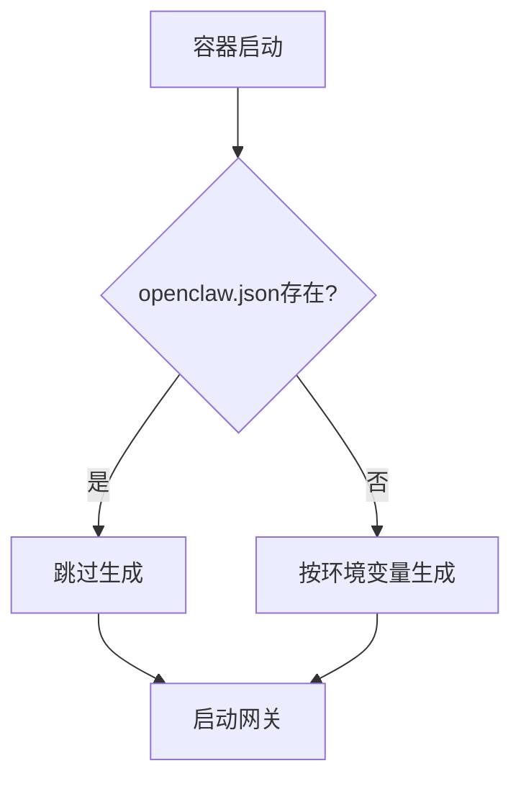

该流程图表达了“存在则跳过、不覆盖”的配置生成边界。Sources: [README.md]()

---

### 2.3 协议与 Base URL 的格式约束不自动纠错
- `openai-completions`：`BASE_URL` 需要 `/v1` 后缀；README 明确给出失败排查建议（如用 `127.0.0.1` 替代 `localhost`）。Sources: [README.md]()
- `anthropic-messages`：`BASE_URL` 通常不需要 `/v1`。Sources: [README.md]()

---

## 3. 关键配置面（环境变量与端口/卷）

### 3.1 Docker Compose 服务定义要点
- 服务名：`openclaw-gateway`
- 容器名：`openclaw-gateway`
- 镜像：`${OPENCLAW_IMAGE}`
- `cap_add`：`CHOWN/SETUID/SETGID/DAC_OVERRIDE`
- `init: true`、`restart: unless-stopped`
- 端口映射：宿主机 `${OPENCLAW_GATEWAY_PORT}` → 容器 `18789`；宿主机 `${OPENCLAW_BRIDGE_PORT}` → 容器 `18790`
- 卷：`${OPENCLAW_DATA_DIR}:/home/node/.openclaw` + 匿名卷 `/home/node/.openclaw/extensions`  
Sources: [docker-compose.yml]()

```yaml
services:
  openclaw-gateway:
    container_name: openclaw-gateway
    image: ${OPENCLAW_IMAGE}
    cap_add:
      - CHOWN
      - SETUID
      - SETGID
      - DAC_OVERRIDE
    user: ${OPENCLAW_RUN_USER:-0:0}
    volumes:
      - ${OPENCLAW_DATA_DIR}:/home/node/.openclaw
      - /home/node/.openclaw/extensions
    ports:
      - "${OPENCLAW_GATEWAY_PORT}:18789"
      - "${OPENCLAW_BRIDGE_PORT}:18790"
```
Sources: [docker-compose.yml]()

---

### 3.2 环境变量总览（按 Compose/README 归类）

| 分类 | 变量 | 含义/用途 | 默认/示例（如有） |
|---|---|---|---|
| AI 模型 | `MODEL_ID` | 模型名称 | README 给出示例：`gemini-3-flash-preview`、`claude-sonnet-4-5` 等 | 
| AI Provider | `BASE_URL` | Provider Base URL | OpenAI 协议示例含 `/v1`；Claude 协议示例不含 `/v1` |
| AI Provider | `API_KEY` | Provider API Key | 示例：`your-api-key` |
| AI 协议 | `API_PROTOCOL` | `openai-completions` / `anthropic-messages` | README 说明两类协议差异 |
| AI 参数 | `CONTEXT_WINDOW` | 上下文窗口 | 示例：`1000000`、`200000` |
| AI 参数 | `MAX_TOKENS` | 最大输出 tokens | 示例：`8192` |
| Gateway | `OPENCLAW_GATEWAY_TOKEN` | 网关访问令牌 | 示例：`123456` |
| Gateway | `OPENCLAW_GATEWAY_BIND` | 绑定地址 | 示例：`lan` |
| Gateway | `OPENCLAW_GATEWAY_PORT` | Gateway 端口 | 默认映射到容器 18789 |
| Gateway | `OPENCLAW_BRIDGE_PORT` | Bridge 端口 | 默认映射到容器 18790 |
| 工作空间 | `WORKSPACE` | 工作空间目录 | README 默认：`/home/node/.openclaw/workspace` |
| 飞书 | `FEISHU_APP_ID` / `FEISHU_APP_SECRET` | 飞书凭证 | 需自行在平台侧创建应用获取 |
| 钉钉 | `DINGTALK_CLIENT_ID` / `DINGTALK_CLIENT_SECRET` 等 | 钉钉凭证 | 需自行在平台侧创建应用获取 |
| QQ | `QQBOT_APP_ID` / `QQBOT_CLIENT_SECRET` | QQ 机器人凭证 | 需自行在平台侧创建获取 |
| 企微 | `WECOM_TOKEN` / `WECOM_ENCODING_AES_KEY` | 企业微信回调加密参数 | 需自行在平台侧创建获取 |
| 可选 | `TELEGRAM_BOT_TOKEN` | Telegram 机器人令牌 | README 描述启用与配对审批 |
| 运行用户 | `OPENCLAW_RUN_USER` | 指定容器运行 UID:GID | 示例：`1000:1000` |
| 镜像/数据 | `OPENCLAW_IMAGE` / `OPENCLAW_DATA_DIR` | Compose 引用的镜像/数据目录 | 由外部 `.env` 提供 |

Sources: [docker-compose.yml](), [README.md](), [.env.example]()

---

### 3.3 端口与对外服务边界
- 容器内部端口固定为 `18789`（Gateway）与 `18790`（Bridge），宿主机端口由环境变量映射决定。Sources: [docker-compose.yml](), [README.md]()
- 端口占用、网络可达性属于宿主机与部署环境问题；README 提示需确保端口未被占用。Sources: [README.md]()

---

## 4. 与 AIClient-2-API 的对接边界与示例

### 4.1 对接前置条件
- 需要先启动 AIClient-2-API 服务，并在其 Web UI 配置至少一个提供商，记录 API Key。Sources: [README.md]()

### 4.2 两类协议示例（README 给出的最小可运行参数集）
- OpenAI 协议示例（含 `/v1`）：`API_PROTOCOL=openai-completions`。Sources: [README.md]()
- Claude 协议示例（不含 `/v1`）：`API_PROTOCOL=anthropic-messages`。Sources: [README.md]()

```mermaid
flowchart TD
  A[OpenClaw] --> B{协议类型}
  B -->|openai| C[BASE_URL含/v1]
  B -->|anthropic| D[BASE_URL不含/v1]
  C --> E[AIClient-2-API]
  D --> E[AIClient-2-API]
```

该图仅表达 README 中明确提出的 Base URL 格式差异与接入对象。Sources: [README.md]()

---

## 5. 版本信息

- 当前仓库版本号记录在 `version.txt`：`2026.2.6-3`。Sources: [version.txt]()

---

## 6. 总结

本项目的“核心功能清单与能力边界”可以概括为：用 Docker 将 OpenClaw Gateway 及其中国 IM 插件进行预装与参数化封装，通过环境变量与持久化卷实现快速部署与稳定运行；而 IM 平台侧的应用创建/权限事件订阅、公网回调可达性、以及已生成配置文件的更新策略（不覆盖、需手动删除再生）明确属于本项目边界之外。Sources: [README.md](), [docker-compose.yml]()

---

<a id='page-5'></a>

## 数据与消息流（含流程图）

### Related Pages

Related topics: [系统架构总览（含架构图）](#page-3), [容器启动与初始化机制（init.sh）](#page-6), [模型对接与协议配置（OpenAI/Claude）](#page-7)

<details>
<summary>Relevant source files</summary>

- [README.md](https://github.com/foobar-ai/openclaw-docker/blob/main/README.md)
- [docker-compose.yml](https://github.com/foobar-ai/openclaw-docker/blob/main/docker-compose.yml)
- [init.sh](https://github.com/foobar-ai/openclaw-docker/blob/main/init.sh)
- [openclaw.json.example](https://github.com/foobar-ai/openclaw-docker/blob/main/openclaw.json.example)
- [Dockerfile](https://github.com/foobar-ai/openclaw-docker/blob/main/Dockerfile)
- [.env.example](https://github.com/foobar-ai/openclaw-docker/blob/main/.env.example)
- [version.txt](https://github.com/foobar-ai/openclaw-docker/blob/main/version.txt)

</details>

# 数据与消息流（含流程图）

本页描述该仓库提供的 Docker 化 OpenClaw Gateway 在“启动初始化 → 配置生成/加载 → 网关对外服务 → IM 通道收发消息 → 上游模型 API 调用 → 结果回传”的端到端数据与消息流，并给出对应的流程图与关键配置汇总。Sources: [README.md](), [docker-compose.yml:1-52](), [init.sh](), [openclaw.json.example]()

## 系统组成与边界

### 运行时组件
- 容器内主服务：OpenClaw Gateway（以 verbose 模式启动）。Sources: [README.md]()
- 初始化入口：`init.sh`（容器主程序，负责目录与配置处理后再拉起网关）。Sources: [README.md](), [init.sh]()
- 配置与数据目录：`/home/node/.openclaw`（宿主机通过卷持久化挂载）。Sources: [README.md](), [docker-compose.yml:44-47]()
- 通道插件：飞书、钉钉、QQ Bot、企业微信等（镜像内预装；并通过配置启用）。Sources: [README.md](), [openclaw.json.example](), [Dockerfile]()

### 外部系统
- 上游模型 Provider：通过 `BASE_URL + API_KEY + API_PROTOCOL` 对接（支持 OpenAI 协议与 Claude 协议两种形态）。Sources: [README.md]()
- IM 平台：Feishu/Lark、DingTalk、QQ Bot、WeCom（通过环境变量提供凭证并在配置中启用）。Sources: [README.md](), [docker-compose.yml:23-43]()

## 顶层数据流总览（容器、配置、通道、模型）

```mermaid
flowchart TD
  A[宿主机Env] --> B[容器启动]
  B --> C[init.sh]
  C --> D[目录创建]
  C --> E[生成配置]
  E --> F[openclaw.json]
  F --> G[Gateway服务]
  G --> H[IM通道]
  G --> I[模型Provider]
  H --> G
  I --> G
  G --> J[回复消息]
```

- `docker-compose.yml` 将环境变量注入容器，并挂载数据目录到 `/home/node/.openclaw`，由 `init.sh` 在启动阶段处理配置文件生成/复用，最终启动 Gateway 对外提供服务。Sources: [docker-compose.yml:13-51](), [README.md](), [init.sh]()

## 启动与初始化数据流

### 环境变量输入 → 配置文件生成/复用
关键行为（以仓库文档与脚本职责为准）：
- 若 `/home/node/.openclaw/openclaw.json` 不存在：根据环境变量动态生成配置文件。Sources: [README.md](), [init.sh](), [openclaw.json.example]()
- 若已存在：跳过自动生成，直接复用宿主持久化配置。Sources: [README.md]()

```mermaid
sequenceDiagram
  autonumber
  participant U as actor 用户/运维
  participant DC as boundary DockerCompose
  participant CT as control 容器入口
  participant IN as control init.sh
  participant FS as entity 挂载卷
  participant GW as control Gateway

  U->>DC: 配置.env并启动
  DC->>CT: 注入环境变量
  CT->>+IN: 执行初始化
  IN->>FS: 检查openclaw.json
  alt 配置不存在
    IN->>FS: 写入openclaw.json
  else 配置已存在
    IN->>FS: 跳过生成
  end
  IN->>GW: 启动gateway(--verbose)
  GW-->>-IN: 进程常驻
```

Sources: [README.md](), [docker-compose.yml:13-43](), [init.sh](), [openclaw.json.example]()

### 持久化与“extensions”目录覆盖策略
- 持久化卷：`${OPENCLAW_DATA_DIR}:/home/node/.openclaw` 用于保存 OpenClaw 配置与数据。Sources: [docker-compose.yml:44-45](), [README.md]()
- `extensions` 目录使用匿名卷覆盖：`- /home/node/.openclaw/extensions`，以避免宿主机目录覆盖镜像内预装插件，确保使用镜像自带 extensions。Sources: [docker-compose.yml:46-47]()

```mermaid
flowchart TD
  V1[宿主机数据卷] --> P1[/home/node/.openclaw]
  V2[匿名卷] --> P2[/home/node/.openclaw/extensions]
  P1 --> C1[配置/工作区]
  P2 --> C2[预装插件]
```

Sources: [docker-compose.yml:44-47](), [README.md]()

## 网关对外端口与访问路径（数据入口/出口）

### 端口映射与服务端口
- 容器内固定端口：Gateway `18789`，Bridge `18790`。Sources: [README.md](), [docker-compose.yml:48-50]()
- 宿主机映射：由 `${OPENCLAW_GATEWAY_PORT}` 与 `${OPENCLAW_BRIDGE_PORT}` 映射到容器内 `18789/18790`。Sources: [docker-compose.yml:48-50]()

| 名称 | 宿主端口 | 容器端口 | 用途 |
|---|---:|---:|---|
| Gateway | `${OPENCLAW_GATEWAY_PORT}` | 18789 | OpenClaw Gateway 服务端口 |
| Bridge | `${OPENCLAW_BRIDGE_PORT}` | 18790 | OpenClaw Bridge 服务端口 |

Sources: [docker-compose.yml:40-43](), [docker-compose.yml:48-50](), [README.md]()

### 绑定与鉴权（网关侧）
- `OPENCLAW_GATEWAY_BIND`：网关绑定地址（示例为 `lan`）。Sources: [README.md](), [docker-compose.yml:41-43]()
- `OPENCLAW_GATEWAY_TOKEN`：访问令牌。Sources: [README.md](), [docker-compose.yml:40-43]()

## IM 消息流（接入→路由→模型→回传）

### 通道启用与凭证输入（环境变量→配置→插件）
`docker-compose.yml` 直接注入各通道所需环境变量，供初始化阶段生成配置并启用对应插件（具体配置结构以 `openclaw.json`/示例为准）。Sources: [docker-compose.yml:23-37](), [README.md](), [openclaw.json.example]()

| 通道 | 关键环境变量（示例） |
|---|---|
| Telegram | `TELEGRAM_BOT_TOKEN` |
| 飞书 | `FEISHU_APP_ID`, `FEISHU_APP_SECRET` |
| 钉钉 | `DINGTALK_CLIENT_ID`, `DINGTALK_CLIENT_SECRET`, `DINGTALK_ROBOT_CODE`, `DINGTALK_CORP_ID`, `DINGTALK_AGENT_ID` |
| QQ Bot | `QQBOT_APP_ID`, `QQBOT_CLIENT_SECRET` |
| 企业微信 | `WECOM_TOKEN`, `WECOM_ENCODING_AES_KEY` |

Sources: [docker-compose.yml:23-37](), [README.md]()

### 典型“收到一条 IM 消息”的时序
```mermaid
sequenceDiagram
  autonumber
  participant IM as boundary IM平台
  participant CH as control 通道插件
  participant GW as control Gateway
  participant PR as boundary 模型API
  participant FS as entity 工作区/配置

  IM-)CH: 推送/拉取消息
  CH->>GW: 上报消息事件
  GW->>FS: 读取配置/上下文
  GW->>+PR: 请求推理(协议适配)
  PR-->>-GW: 返回模型输出
  GW->>CH: 生成回复载荷
  CH-->>IM: 发送回复
```

Sources: [README.md](), [openclaw.json.example](), [docker-compose.yml:16-43]()

## 模型调用数据流（OpenAI 协议 vs Claude 协议）

### 统一输入参数（容器环境变量）
- `MODEL_ID`：模型名。Sources: [README.md](), [docker-compose.yml:16-22]()
- `BASE_URL`：Provider Base URL（OpenAI 协议通常需要 `/v1`，Claude 协议不需要）。Sources: [README.md](), [docker-compose.yml:17-22]()
- `API_KEY`：Provider Key。Sources: [README.md](), [docker-compose.yml:19-22]()
- `API_PROTOCOL`：`openai-completions` 或 `anthropic-messages`。Sources: [README.md](), [docker-compose.yml:20-22]()
- `CONTEXT_WINDOW` / `MAX_TOKENS`：上下文与输出上限。Sources: [README.md](), [docker-compose.yml:21-22]()

```mermaid
flowchart TD
  E1[MODEL_ID] --> C[Provider配置]
  E2[BASE_URL] --> C
  E3[API_KEY] --> C
  E4[API_PROTOCOL] --> C
  E5[CONTEXT_WINDOW] --> C
  E6[MAX_TOKENS] --> C
  C --> R[请求适配]
  R --> P[上游API]
```

Sources: [docker-compose.yml:16-22](), [README.md]()

### 协议分支（以配置选择为准）
```mermaid
sequenceDiagram
  autonumber
  participant GW as control Gateway
  participant CFG as entity Provider配置
  participant OA as boundary OpenAI兼容API
  participant AN as boundary Anthropic消息API

  GW->>CFG: 读取API_PROTOCOL
  alt openai-completions
    GW->>OA: 调用BASE_URL(/v1)
    OA-->>GW: 返回结果
  else anthropic-messages
    GW->>AN: 调用BASE_URL(无/v1)
    AN-->>GW: 返回结果
  end
```

Sources: [README.md](), [docker-compose.yml:17-22]()

## Docker Compose 运行时数据注入与权限相关流

### 运行用户、能力与初始化修复
- Compose 指定 `cap_add: CHOWN/SETUID/SETGID/DAC_OVERRIDE`，配合 `init.sh` 在启动阶段处理挂载目录权限问题。Sources: [docker-compose.yml:5-12](), [README.md](), [init.sh]()
- `user: ${OPENCLAW_RUN_USER:-0:0}`：默认以 root 启动，便于初始化脚本修复卷权限后再降权（具体降权逻辑由 `init.sh` 决定）。Sources: [docker-compose.yml:10-12](), [README.md](), [init.sh]()

```mermaid
flowchart TD
  A[root启动] --> B[init.sh]
  B --> C[修复卷权限]
  C --> D[启动网关]
```

Sources: [docker-compose.yml:5-12](), [README.md](), [init.sh]()

### Compose 关键片段（环境变量与卷）
```yaml
services:
  openclaw-gateway:
    environment:
      MODEL_ID: ${MODEL_ID}
      BASE_URL: ${BASE_URL}
      API_PROTOCOL: ${API_PROTOCOL}
    volumes:
      - ${OPENCLAW_DATA_DIR}:/home/node/.openclaw
      - /home/node/.openclaw/extensions
```

Sources: [docker-compose.yml:13-47]()

## 配置文件与工作空间的数据归档路径

### 路径约定
- 配置/数据目录：`/home/node/.openclaw`。Sources: [README.md](), [docker-compose.yml:44-45]()
- 工作空间目录：默认 `/home/node/.openclaw/workspace`（也可通过 `WORKSPACE` 环境变量注入）。Sources: [README.md](), [docker-compose.yml:37-38]()

```mermaid
flowchart TD
  R[/home/node/.openclaw] --> J[openclaw.json]
  R --> W[workspace]
  W --> F[任务文件]
```

Sources: [README.md](), [docker-compose.yml:37-47](), [openclaw.json.example]()

## 版本信息
- 当前仓库版本标识：`2026.2.6-3`。Sources: [version.txt:1]()

## 总结
该镜像通过 `docker-compose.yml` 注入模型与通道参数、挂载持久化目录并用匿名卷保护预装插件目录；容器入口 `init.sh` 负责在首次启动时生成/复用 `openclaw.json`，随后启动 OpenClaw Gateway，完成“IM 消息接入 → 网关路由 → 上游模型协议适配调用 → 结果回传”的闭环数据与消息流。Sources: [README.md](), [docker-compose.yml:13-52](), [init.sh](), [openclaw.json.example](), [version.txt:1]()

---

<a id='page-6'></a>

## 容器启动与初始化机制（init.sh）

### Related Pages

Related topics: [数据与消息流（含流程图）](#page-5), [部署指南（Docker Compose / Docker Run）](#page-8), [扩展与自定义：插件、配置文件与运行用户](#page-10)

<details>
<summary>Relevant source files</summary>

The following files were used as context for generating this wiki page:

- [init.sh](https://github.com/foobar-ai/openclaw-docker/blob/main/init.sh)
- [Dockerfile](https://github.com/foobar-ai/openclaw-docker/blob/main/Dockerfile)
- [openclaw.json.example](https://github.com/foobar-ai/openclaw-docker/blob/main/openclaw.json.example)
- [.env.example](https://github.com/foobar-ai/openclaw-docker/blob/main/.env.example)
- [README.md](https://github.com/foobar-ai/openclaw-docker/blob/main/README.md)
- [docker-compose.yml](https://github.com/foobar-ai/openclaw-docker/blob/main/docker-compose.yml)
- [version.txt](https://github.com/foobar-ai/openclaw-docker/blob/main/version.txt)

</details>

# 容器启动与初始化机制（init.sh）

本项目将 OpenClaw Gateway 打包为“开箱即用”的 Docker 镜像，并通过容器入口初始化脚本 `init.sh` 在首次启动时完成目录创建、配置文件生成与权限修复，然后以 verbose 模式启动网关服务。Sources: [README.md:1-260](), [docker-compose.yml:1-39]()

该机制与 `docker-compose.yml` 的运行参数（capabilities、user、卷挂载、端口映射、环境变量注入）共同构成完整启动链路，确保挂载卷数据持久化、配置可由环境变量驱动、并尽量避免因宿主机目录 UID/GID 不一致导致的写入失败。Sources: [README.md:200-360](), [docker-compose.yml:1-39]()

---

## 1. 启动链路总览（Compose → init.sh → openclaw gateway）

```mermaid
flowchart TD
  A[docker compose] --> B[容器启动]
  B --> C[init.sh]
  C --> D[创建目录]
  C --> E[生成配置]
  C --> F[修复权限]
  F --> G[启动网关]
  G --> H[18789网关]
  G --> I[18790桥接]
```

- 通过 `docker-compose.yml` 启动服务 `openclaw-gateway`，容器内 HOME 固定为 `/home/node`，数据目录挂载到 `/home/node/.openclaw`。Sources: [docker-compose.yml:1-39]()
- `init.sh` 作为容器主程序执行初始化：创建目录结构、若配置不存在则按环境变量生成配置、设置权限、启动 `openclaw gateway --verbose`。Sources: [README.md:120-170]()

---

## 2. 容器运行参数如何支撑初始化（docker-compose.yml）

### 2.1 Capability：为“卷权限修复”提供条件

Compose 为容器添加如下 capabilities：`CHOWN`、`SETUID`、`SETGID`、`DAC_OVERRIDE`，用于在启动阶段对挂载卷执行所有权/权限调整与降权运行相关操作。Sources: [docker-compose.yml:1-14]()

| Capability | 用途（与初始化相关） |
|---|---|
| CHOWN | 调整挂载目录/文件属主 |
| SETUID | 允许切换/设置运行 UID |
| SETGID | 允许切换/设置运行 GID |
| DAC_OVERRIDE | 绕过部分权限检查以完成修复 |

Sources: [docker-compose.yml:1-14](), [README.md:300-360]()

### 2.2 user：默认 root 启动，修复后再“降权”思路

Compose 使用 `user: ${OPENCLAW_RUN_USER:-0:0}`，默认以 `0:0`（root）启动，以便 `init.sh` 在启动时“自动修复挂载卷权限后再降权运行网关”。Sources: [docker-compose.yml:8-14](), [README.md:330-360]()

> 若希望直接指定运行 UID:GID，可通过 `.env` 设置 `OPENCLAW_RUN_USER=1000:1000` 并重启。Sources: [README.md:340-360](), [docker-compose.yml:8-14]()

### 2.3 环境变量注入：驱动配置生成

Compose 将模型、通道、工作空间与网关参数以环境变量注入容器；这些变量被 README 描述为会被初始化脚本用于“动态生成配置文件（如果不存在）”。Sources: [docker-compose.yml:14-35](), [README.md:150-190]()

| 类别 | 环境变量（示例） | 作用 |
|---|---|---|
| 模型 | `MODEL_ID` `BASE_URL` `API_KEY` `API_PROTOCOL` `CONTEXT_WINDOW` `MAX_TOKENS` | Provider/模型与上下文、输出限制 |
| 通道 | `TELEGRAM_BOT_TOKEN` `FEISHU_APP_ID`/`SECRET` `DINGTALK_*` `QQBOT_*` `WECOM_*` | 启用与配置各 IM 插件 |
| 工作空间 | `WORKSPACE` | 指定工作空间目录 |
| 网关 | `OPENCLAW_GATEWAY_TOKEN` `OPENCLAW_GATEWAY_BIND` `OPENCLAW_GATEWAY_PORT` `OPENCLAW_BRIDGE_PORT` | 网关鉴权、绑定与端口 |

Sources: [docker-compose.yml:14-35](), [README.md:70-120](), [README.md:170-230]()

### 2.4 卷挂载策略：数据持久化 + 排除 extensions

Compose 声明两条 volumes：

1) 将 `${OPENCLAW_DATA_DIR}` 挂载到 `/home/node/.openclaw` 用于持久化配置与数据。  
2) 使用匿名卷挂载 `/home/node/.openclaw/extensions`，以“排除 extensions 目录，使用镜像中预装的插件”。Sources: [docker-compose.yml:35-37](), [README.md:90-120]()

```mermaid
flowchart TD
  A[宿主机目录] --> B[/home/node/.openclaw]
  C[匿名卷] --> D[extensions]
  D --> E[镜像预装插件]
```

Sources: [docker-compose.yml:35-37](), [README.md:140-170]()

### 2.5 端口映射：宿主机端口 → 容器固定端口

Compose 将宿主机 `${OPENCLAW_GATEWAY_PORT}` 映射到容器 `18789`，`${OPENCLAW_BRIDGE_PORT}` 映射到容器 `18790`。README 对应说明：`18789` 为 Gateway，`18790` 为 Bridge。Sources: [docker-compose.yml:37-39](), [README.md:100-120]()

---

## 3. init.sh 的核心职责与决策点（以 README 描述为准）

### 3.1 初始化任务清单

README 明确列出 `init.sh` 在容器启动时执行的动作：

1. 创建必要的目录结构  
2. 根据环境变量动态生成配置文件（如果不存在）  
3. 设置正确的文件权限  
4. 启动 OpenClaw Gateway 服务（verbose 模式）  

Sources: [README.md:120-170]()

### 3.2 “是否生成配置文件”的分支逻辑

当 `/home/node/.openclaw/openclaw.json` 不存在时，初始化脚本会根据环境变量自动生成；若已存在则“跳过自动生成”。Sources: [README.md:110-140]()

```mermaid
flowchart TD
  A[启动容器] --> B{openclaw.json存在?}
  B -->|否| C[读环境变量]
  C --> D[生成openclaw.json]
  B -->|是| E[跳过生成]
  D --> F[启动网关]
  E --> F[启动网关]
```

Sources: [README.md:110-160]()

### 3.3 生成的配置内容范围（高层）

README 描述自动生成的配置文件包含：

- 模型配置：指定模型与 Provider  
- 通道配置：按环境变量启用 IM 平台  
- Gateway 配置：端口、绑定地址、认证令牌  
- 插件配置：自动启用相应通道插件  

Sources: [README.md:150-190]()

> 具体 JSON 字段结构应以 `openclaw.json.example` 与 `init.sh` 实现为准（本页面不引入未在源文件中明确展示的字段细节）。Sources: [openclaw.json.example](), [init.sh]()

---

## 4. 权限与“偶发 Permission denied”的处理机制

### 4.1 问题现象与根因（README 定义）

README 指出“同样的启动命令偶发 Permission denied”通常源于宿主机挂载目录所有者（UID/GID）与容器内运行用户不一致：你手动创建目录可能为 `1000:1000`，而 sudo 或 Docker 自动创建可能为 `root:root`。Sources: [README.md:300-340]()

### 4.2 推荐排查与修复路径

README 给出排查与修复建议：

- 宿主机查看 `~/.openclaw` 归属：`ls -ln ~/.openclaw`  
- 查看容器内运行用户：`docker run --rm ... id`  
- 修复目录所有权：`sudo chown -R 1000:1000 ~/.openclaw`  
- 或使用 `.env` 指定 `OPENCLAW_RUN_USER=1000:1000`  

Sources: [README.md:320-360]()

### 4.3 本项目“稳态处理”声明（init.sh 行为摘要）

README 声明本项目已做“稳态处理”，包括：

- `docker-compose.yml` 增加可选 `user` 配置 `OPENCLAW_RUN_USER`（默认 `0:0`）  
- `init.sh` 启动时会打印挂载目录 UID/GID 与目标 UID/GID、尝试自动修复 `/home/node/.openclaw` 权限；若仍不可写则输出明确修复命令并失败退出，避免隐性不稳定状态  

Sources: [README.md:350-380](), [docker-compose.yml:8-14]()

```mermaid
sequenceDiagram
  autonumber
  participant DC as docker-compose
  participant CT as 容器
  participant IN as init.sh
  participant FS as 挂载目录
  participant GW as openclaw网关

  DC->>CT: 启动(含cap与user)
  CT->>+IN: 运行初始化
  IN->>FS: 读取UID/GID
  IN->>FS: 尝试修复权限
  alt 可写
    IN->>GW: 启动verbose
    GW-->>IN: 运行中
  else 不可写
    IN->>FS: 输出修复命令
    IN->xCT: 失败退出
  end
```

Sources: [README.md:350-380](), [docker-compose.yml:1-14]()

---

## 5. 网关启动模式与运行端口

### 5.1 启动命令

容器使用如下命令启动 OpenClaw：

- `openclaw gateway --verbose`（详细日志模式）  

Sources: [README.md:170-190]()

### 5.2 端口语义

- `18789`：OpenClaw Gateway  
- `18790`：OpenClaw Bridge  

Sources: [README.md:100-120](), [docker-compose.yml:37-39]()

---

## 6. 与镜像构建的关系（Dockerfile 与预装能力）

README 说明镜像“已全局安装”若干 npm 包（OpenClaw 主程序、OpenCode AI、Playwright 以及多个中国 IM 插件），并在“项目文件说明”中标注 `Dockerfile` 为镜像构建文件。Sources: [README.md:130-210]()

> 具体安装步骤与版本以 `Dockerfile` 内容为准（本页面不在缺少明确片段时展开逐行安装细节）。Sources: [Dockerfile](), [README.md:130-210]()

---

## 7. 版本标识

仓库包含 `version.txt`，当前内容为 `2026.2.6-3`，可作为镜像/发布物的轻量版本标记参考。Sources: [version.txt:1]()

---

## 8. 快速操作要点（与初始化强相关）

| 场景 | 操作 | 结果 |
|---|---|---|
| 环境变量改了但不生效 | 删除 `~/.openclaw/openclaw.json` 后重启容器 | 触发 `init.sh` 重新生成配置 |
| 想完全自定义配置 | 宿主机创建 `~/.openclaw/openclaw.json` 并挂载目录 | 容器检测到已存在配置文件则跳过生成 |
| 遇到写入权限问题 | `sudo chown -R 1000:1000 ~/.openclaw` 或设置 `OPENCLAW_RUN_USER` | 解决 UID/GID 不匹配导致的不可写 |

Sources: [README.md:110-160](), [README.md:320-380](), [docker-compose.yml:8-14]()

---

## 总结

`init.sh` 是该镜像“开箱即用”的关键：它在容器启动阶段围绕挂载卷可写性与首次配置生成做自动化处理，并最终以 `openclaw gateway --verbose` 形式启动服务；与 `docker-compose.yml` 的 capabilities、user、卷挂载与端口映射配合，形成稳定的初始化与运行闭环。Sources: [README.md:120-200](), [README.md:300-380](), [docker-compose.yml:1-39]()

---

<a id='page-7'></a>

## 模型对接与协议配置（OpenAI/Claude）

### Related Pages

Related topics: [项目简介与快速开始](#page-1), [数据与消息流（含流程图）](#page-5), [扩展与自定义：插件、配置文件与运行用户](#page-10)

<details>
<summary>Relevant source files</summary>

- [README.md](https://github.com/foobar-ai/openclaw-docker/blob/main/README.md)
- [.env.example](https://github.com/foobar-ai/openclaw-docker/blob/main/.env.example)
- [openclaw.json.example](https://github.com/foobar-ai/openclaw-docker/blob/main/openclaw.json.example)
- [docker-compose.yml](https://github.com/foobar-ai/openclaw-docker/blob/main/docker-compose.yml)
- [init.sh](https://github.com/foobar-ai/openclaw-docker/blob/main/init.sh)
- [Dockerfile](https://github.com/foobar-ai/openclaw-docker/blob/main/Dockerfile)
- [version.txt](https://github.com/foobar-ai/openclaw-docker/blob/main/version.txt)
</details>

# 模型对接与协议配置（OpenAI/Claude）

本项目通过环境变量与自动生成配置文件的方式，将 OpenClaw Gateway 对接到上游模型服务，并支持两种 API 协议：OpenAI 兼容的 `openai-completions` 与 Anthropic Claude 的 `anthropic-messages`。核心目标是让容器以“开箱即用”的方式完成 Provider（上游 API）与模型参数的注入，并在首次启动时生成 `openclaw.json`。  
Sources: [README.md](), [docker-compose.yml:13-43](), [init.sh](), [openclaw.json.example]()

## 总体架构与数据流

配置与启动的关键链路如下：宿主机 `.env` → Docker Compose 注入环境变量 → 容器 `init.sh`（若无配置则生成）→ 启动 `openclaw gateway --verbose` 对接上游模型服务。  
Sources: [README.md](), [docker-compose.yml:13-52](), [init.sh]()

```mermaid
flowchart TD
  A[".env 配置"] --> B["Compose 注入"]
  B --> C["容器启动"]
  C --> D["init.sh 生成"]
  D --> E["openclaw.json"]
  E --> F["Gateway 启动"]
  F --> G["上游 API"]
```

该流程体现了“环境变量驱动配置”的策略：仅当目标配置文件不存在时才生成，避免覆盖用户自定义配置。  
Sources: [README.md](), [init.sh]()

## 协议类型与 Base URL 规则

### `openai-completions`（OpenAI/Gemini 等）

- `API_PROTOCOL=openai-completions`
- `BASE_URL` 需要包含 `/v1` 后缀（例如 `http://localhost:3000/v1`）
- 示例中常配合大上下文模型参数（如 `CONTEXT_WINDOW=1000000`、`MAX_TOKENS=8192`）  
Sources: [README.md]()

### `anthropic-messages`（Claude）

- `API_PROTOCOL=anthropic-messages`
- `BASE_URL` 不需要 `/v1` 后缀（例如 `http://localhost:3000`）
- README 明确指出该协议具备 Prompt Caching、Extended Thinking 等特性说明（以文档描述为准）  
Sources: [README.md]()

```mermaid
flowchart TD
  P["选择协议"] --> O["openai-completions"]
  P --> C["anthropic-messages"]
  O --> O1["BASE_URL 含 /v1"]
  C --> C1["BASE_URL 不含 /v1"]
```

Sources: [README.md]()

## 核心环境变量（模型对接）

容器通过环境变量注入模型与 Provider 参数，`docker-compose.yml` 中明确声明并传入容器：  
Sources: [docker-compose.yml:16-22]()

| 环境变量 | 类型/用途 | 说明 |
|---|---|---|
| `MODEL_ID` | 模型标识 | 上游模型名称/ID |
| `BASE_URL` | Provider 地址 | 上游 API Base URL（是否带 `/v1` 取决于协议） |
| `API_KEY` | 鉴权 | 上游 API Key |
| `API_PROTOCOL` | 协议选择 | `openai-completions` 或 `anthropic-messages` |
| `CONTEXT_WINDOW` | 上下文窗口 | 配置模型上下文大小 |
| `MAX_TOKENS` | 输出上限 | 配置最大输出 tokens |

Sources: [docker-compose.yml:16-22](), [README.md](), [.env.example]()

### `.env` 配置示例（来自 README）

OpenAI 协议（推荐用于 Gemini）的示例：  
Sources: [README.md]()

```bash
MODEL_ID=gemini-3-flash-preview
BASE_URL=http://localhost:3000/v1
API_KEY=your-api-key
API_PROTOCOL=openai-completions
CONTEXT_WINDOW=1000000
MAX_TOKENS=8192
```

Claude 协议（推荐用于 Claude）的示例：  
Sources: [README.md]()

```bash
MODEL_ID=claude-sonnet-4-5
BASE_URL=http://localhost:3000
API_KEY=your-api-key
API_PROTOCOL=anthropic-messages
CONTEXT_WINDOW=200000
MAX_TOKENS=8192
```

## 指定特定提供商（通过 Base URL 路由）

README 提供了通过调整 `BASE_URL` 路径来指定特定提供商的方式（仍属于“上游 API 路由”层面的配置）。  
Sources: [README.md]()

| 场景 | `BASE_URL` 示例 | 协议提示 |
|---|---|---|
| Kiro Claude（OpenAI 协议） | `http://localhost:3000/claude-kiro-oauth/v1` | 需要 `/v1` |
| Kiro Claude（Claude 协议） | `http://localhost:3000/claude-kiro-oauth` | 不需要 `/v1` |
| Gemini CLI（OpenAI 协议） | `http://localhost:3000/gemini-cli-oauth/v1` | 需要 `/v1` |
| Antigravity（OpenAI 协议） | `http://localhost:3000/gemini-antigravity/v1` | 需要 `/v1` |

Sources: [README.md]()

```mermaid
flowchart TD
  A["BASE_URL"] --> B["根路径"]
  A --> C["带路由"]
  C --> D["claude-kiro"]
  C --> E["gemini-cli"]
  C --> F["antigravity"]
```

Sources: [README.md]()

## 配置文件生成与持久化

### 自动生成规则（首次启动）

README 约定：当 `/home/node/.openclaw/openclaw.json` 不存在时，初始化脚本会依据环境变量生成配置文件；若配置已存在则跳过自动生成。  
Sources: [README.md](), [init.sh]()

```mermaid
flowchart TD
  S["容器启动"] --> C{"openclaw.json 存在?"}
  C -->|否| G["按 env 生成"]
  C -->|是| K["跳过生成"]
  G --> R["启动网关"]
  K --> R["启动网关"]
```

Sources: [README.md](), [init.sh]()

### 数据卷与目录约定

- `/home/node/.openclaw`：OpenClaw 配置与数据目录（持久化）
- `/home/node/.openclaw/workspace`：工作空间目录（持久化/工作数据）  
Sources: [README.md]()

`docker-compose.yml` 将宿主机 `${OPENCLAW_DATA_DIR}` 挂载到容器 `/home/node/.openclaw`，并使用匿名卷覆盖 `extensions` 目录，以使用镜像内预装插件。  
Sources: [docker-compose.yml:44-47]()

## Docker Compose 如何注入模型配置

`docker-compose.yml` 将模型对接相关的 6 个关键变量显式映射到容器环境，并设置 `HOME=/home/node`。  
Sources: [docker-compose.yml:13-22]()

```yaml
environment:
  HOME: /home/node
  MODEL_ID: ${MODEL_ID}
  BASE_URL: ${BASE_URL}
  API_KEY: ${API_KEY}
  API_PROTOCOL: ${API_PROTOCOL}
  CONTEXT_WINDOW: ${CONTEXT_WINDOW}
  MAX_TOKENS: ${MAX_TOKENS}
```

Sources: [docker-compose.yml:13-22]()

同时 Compose 支持通过 `OPENCLAW_RUN_USER` 指定容器运行 UID:GID；README 说明镜像会以 `node` 用户运行网关，挂载卷权限不一致可能导致 `Permission denied`，并给出修复策略。  
Sources: [docker-compose.yml:10-12](), [README.md](), [init.sh]()

## 运行与端口（与模型对接的联动点）

- 网关以 verbose 模式启动：`openclaw gateway --verbose`（用于观察上游对接日志与请求情况）  
Sources: [README.md]()

- 对外端口：
  - `18789`：OpenClaw Gateway
  - `18790`：OpenClaw Bridge  
Sources: [README.md](), [docker-compose.yml:48-50]()

## 常见问题（对接相关）

### 环境变量修改后不生效

若已经生成过配置文件，后续修改环境变量不会自动覆盖；需要删除 `~/.openclaw/openclaw.json` 或删除整个 `~/.openclaw` 后重启容器。  
Sources: [README.md]()

### 连接上游失败/401

README 指出排查要点包括：确认上游服务运行、检查 Base URL（OpenAI 协议需要 `/v1`）、API Key 是否正确、必要时用 `127.0.0.1` 替代 `localhost`。  
Sources: [README.md]()

## 版本信息

仓库包含版本文件：  
Sources: [version.txt:1]()

- `2026.2.6-3`  
Sources: [version.txt:1]()

## 总结

本项目的模型对接以环境变量为入口、以 `init.sh` 的“首次生成配置”机制为核心，支持 `openai-completions` 与 `anthropic-messages` 两种协议，并通过 `BASE_URL`（含/不含 `/v1`）实现与不同上游 Provider 的对接与路由切换；在 Docker Compose 中以明确的变量映射与数据卷持久化来保证配置稳定与可迁移。  
Sources: [README.md](), [docker-compose.yml:13-52](), [init.sh](), [.env.example](), [openclaw.json.example]()

---

<a id='page-8'></a>

## 部署指南（Docker Compose / Docker Run）

### Related Pages

Related topics: [容器启动与初始化机制（init.sh）](#page-6), [数据与消息流（含流程图）](#page-5), [镜像构建与发布流水线（CI/CD）](#page-9)

<details>
<summary>Relevant source files</summary>

- [docker-compose.yml](https://github.com/foobar-ai/openclaw-docker/blob/main/docker-compose.yml)
- [README.md](https://github.com/foobar-ai/openclaw-docker/blob/main/README.md)
- [.env.example](https://github.com/foobar-ai/openclaw-docker/blob/main/.env.example)
- [Dockerfile](https://github.com/foobar-ai/openclaw-docker/blob/main/Dockerfile)
- [init.sh](https://github.com/foobar-ai/openclaw-docker/blob/main/init.sh)
- [openclaw.json.example](https://github.com/foobar-ai/openclaw-docker/blob/main/openclaw.json.example)
- [version.txt](https://github.com/foobar-ai/openclaw-docker/blob/main/version.txt)

</details>

# 部署指南（Docker Compose / Docker Run）

本项目提供一个“开箱即用”的 Docker 镜像，用于运行 OpenClaw Gateway，并预装飞书、钉钉、QQ 机器人、企业微信等中国 IM 平台插件；通过环境变量生成/驱动配置，并支持挂载卷进行数据持久化与工作空间保留。Sources: [README.md](), [Dockerfile](), [init.sh](), [docker-compose.yml]()

部署方式覆盖两条主线：使用 `docker-compose.yml` 的一键编排，以及直接 `docker run` 的命令行启动；两者核心一致：注入模型/通道/Gateway 相关环境变量、挂载数据目录、暴露 18789/18790 端口，并由容器入口初始化逻辑处理配置与权限。Sources: [README.md](), [docker-compose.yml](), [init.sh]()

---

## 部署架构概览

```mermaid
flowchart TD
  A[宿主机] --> B[Docker 引擎]
  B --> C[OpenClaw 容器]
  C --> D[init 初始化]
  D --> E[配置生成]
  E --> F[Gateway 启动]
  F --> G[18789 服务]
  F --> H[18790 Bridge]
  C --> I[数据卷]
  I --> J[.openclaw 目录]
  I --> K[workspace 目录]
```

容器以初始化脚本作为启动入口：准备目录、在配置不存在时按环境变量生成配置、修复挂载目录权限、最后启动 `openclaw gateway --verbose`。Sources: [README.md](), [init.sh]()

---

## 前置准备

### 1) 准备模型 Provider（可对接 AIClient-2-API）

支持两种协议形态：
- OpenAI 协议：`API_PROTOCOL=openai-completions`（Base URL 通常需要 `/v1` 后缀）
- Claude 协议：`API_PROTOCOL=anthropic-messages`（Base URL 通常不需要 `/v1` 后缀）  
Sources: [README.md]()

### 2) 准备环境变量文件（推荐）

项目提供 `.env.example` 作为环境变量模板；通常做法是复制为 `.env` 并按需填写。Sources: [README.md](), [.env.example]()

---

## 使用 Docker Compose 部署（推荐）

### Compose 服务定义要点

`docker-compose.yml` 中定义单服务 `openclaw-gateway`，通过环境变量选择镜像、端口、挂载卷与运行用户，并授予若干能力以便初始化阶段修复权限（例如 `CHOWN` 等）。Sources: [docker-compose.yml](), [README.md]()

关键点汇总：

| 维度 | 配置点 | 说明 |
|---|---|---|
| 容器名 | `container_name: openclaw-gateway` | 固定容器名便于运维 |
| 镜像 | `image: ${OPENCLAW_IMAGE}` | 由 `.env` 提供 |
| 能力 | `cap_add: CHOWN/SETUID/SETGID/DAC_OVERRIDE` | 便于初始化脚本修复挂载目录权限 |
| 用户 | `user: ${OPENCLAW_RUN_USER:-0:0}` | 默认 root 启动，随后再降权（按项目说明） |
| 端口 | `${OPENCLAW_GATEWAY_PORT}:18789`、`${OPENCLAW_BRIDGE_PORT}:18790` | 对外暴露网关与 Bridge |
| 卷 | `${OPENCLAW_DATA_DIR}:/home/node/.openclaw` + 匿名卷排除 `extensions` | 数据持久化；插件优先使用镜像预装 |
| 重启 | `restart: unless-stopped` | 守护式运行 |
| init | `init: true` | 启用 tini 处理僵尸进程等 |

Sources: [docker-compose.yml](), [README.md]()

### Compose 启动流程

```mermaid
sequenceDiagram
  autonumber
  participant U as 用户
  participant DC as docker compose
  participant C as 容器
  participant I as init.sh
  participant FS as 挂载目录
  participant G as Gateway

  U->>DC: up -d
  DC->>C: 创建并启动
  C->>+I: 执行初始化
  I->>FS: 创建目录/检查可写
  I->>FS: 必要时修复权限
  I->>FS: 不存在则生成 openclaw.json
  I-->>-G: 启动 gateway --verbose
```

Sources: [README.md](), [docker-compose.yml](), [init.sh]()

### Compose 启动命令

```bash
docker-compose up -d
docker-compose logs -f
docker-compose down
```

Sources: [README.md]()

---

## 使用 Docker Run 部署（命令行）

项目提供了等价的 `docker run` 示例：通过 `--cap-add` 授权、`-e` 注入环境变量、`-v` 挂载持久化目录、`-p` 暴露端口并设置自动重启策略。Sources: [README.md]()

```bash
docker run -d \
  --name openclaw-gateway \
  --cap-add=CHOWN \
  --cap-add=SETUID \
  --cap-add=SETGID \
  --cap-add=DAC_OVERRIDE \
  -e MODEL_ID=... \
  -e BASE_URL=... \
  -e API_KEY=... \
  -e API_PROTOCOL=... \
  -e CONTEXT_WINDOW=... \
  -e MAX_TOKENS=... \
  -e OPENCLAW_GATEWAY_TOKEN=... \
  -e OPENCLAW_GATEWAY_BIND=... \
  -e OPENCLAW_GATEWAY_PORT=18789 \
  -e OPENCLAW_BRIDGE_PORT=18790 \
  -v ~/.openclaw:/home/node/.openclaw \
  -v ~/.openclaw/workspace:/home/node/.openclaw/workspace \
  -p 18789:18789 \
  -p 18790:18790 \
  --restart unless-stopped \
  justlikemaki/openclaw-docker-cn-im:latest
```

Sources: [README.md]()

---

## 环境变量与配置映射

### 关键环境变量（最小可运行集）

| 环境变量 | 用途 |
|---|---|
| `MODEL_ID` | 模型名称/ID |
| `BASE_URL` | Provider Base URL |
| `API_KEY` | Provider API Key |
| `API_PROTOCOL` | 协议类型（OpenAI/Claude） |
| `CONTEXT_WINDOW` | 上下文窗口 |
| `MAX_TOKENS` | 最大输出 tokens |

Sources: [README.md](), [docker-compose.yml](), [.env.example]()

### Gateway/Bridge 相关

| 环境变量 | 用途 | 备注 |
|---|---|---|
| `OPENCLAW_GATEWAY_TOKEN` | 网关访问令牌 | 用于鉴权 |
| `OPENCLAW_GATEWAY_BIND` | 绑定地址 | 例如 `lan` |
| `OPENCLAW_GATEWAY_PORT` | 对外映射端口（宿主机侧） | 容器内固定 18789 |
| `OPENCLAW_BRIDGE_PORT` | 对外映射端口（宿主机侧） | 容器内固定 18790 |

Sources: [README.md](), [docker-compose.yml](), [.env.example]()

### 通道（IM）相关（按需启用）

`docker-compose.yml` 直接透传多种通道环境变量；是否生效由容器配置生成逻辑决定。Sources: [docker-compose.yml](), [README.md](), [init.sh](), [openclaw.json.example]()

| 平台 | 环境变量（示例） |
|---|---|
| Telegram | `TELEGRAM_BOT_TOKEN` |
| 飞书 | `FEISHU_APP_ID`、`FEISHU_APP_SECRET` |
| 钉钉 | `DINGTALK_CLIENT_ID`、`DINGTALK_CLIENT_SECRET`、`DINGTALK_ROBOT_CODE`、`DINGTALK_CORP_ID`、`DINGTALK_AGENT_ID` |
| QQ 机器人 | `QQBOT_APP_ID`、`QQBOT_CLIENT_SECRET` |
| 企业微信 | `WECOM_TOKEN`、`WECOM_ENCODING_AES_KEY` |

Sources: [docker-compose.yml](), [README.md](), [.env.example]()

---

## 端口与对外暴露

### 端口说明

- `18789`：OpenClaw Gateway
- `18790`：OpenClaw Bridge  

Compose 中将宿主机端口映射到容器内固定端口（`18789`、`18790`）。Sources: [README.md](), [docker-compose.yml]()

```mermaid
flowchart TD
  A[宿主机端口] --> B[端口映射]
  B --> C[容器 18789]
  B --> D[容器 18790]
  C --> E[Gateway]
  D --> F[Bridge]
```

Sources: [README.md](), [docker-compose.yml]()

---

## 数据持久化与目录挂载

### 持久化目录

容器使用卷持久化以下目录：
- `/home/node/.openclaw`：OpenClaw 配置与数据目录
- `/home/node/.openclaw/workspace`：工作空间目录（也可单独挂载）  

Sources: [README.md]()

Compose 默认挂载 `${OPENCLAW_DATA_DIR}:/home/node/.openclaw`，并通过匿名卷“排除” `extensions` 目录，以优先使用镜像内预装插件。Sources: [docker-compose.yml]()

```mermaid
flowchart TD
  A[宿主机数据] --> B[挂载到容器]
  B --> C[.openclaw]
  C --> D[配置数据]
  C --> E[workspace]
  C --> F[extensions]
  F --> G[匿名卷]
```

Sources: [docker-compose.yml](), [README.md]()

---

## 配置文件生成与自定义

### 自动生成规则（首次启动）

若 `/home/node/.openclaw/openclaw.json` 不存在，初始化脚本会基于环境变量生成配置，包含：
- 模型配置（模型与 Provider）
- 通道配置（按提供的环境变量启用对应 IM 平台）
- Gateway 配置（端口、绑定、认证令牌）
- 插件配置（自动启用相应通道插件）  

Sources: [README.md](), [init.sh](), [openclaw.json.example]()

### 完全自定义配置

若宿主机提前创建 `~/.openclaw/openclaw.json` 并挂载 `~/.openclaw:/home/node/.openclaw`，容器检测到已存在配置文件将跳过自动生成。Sources: [README.md](), [init.sh]()

---

## 权限与运行用户（避免 Permission denied）

### Compose 的用户策略

Compose 提供 `OPENCLAW_RUN_USER` 可选项；默认 `user: 0:0` 以便启动时修复挂载卷权限，再按项目说明降权运行网关。Sources: [docker-compose.yml](), [README.md](), [init.sh]()

### 常见问题与修复

当宿主机挂载目录所有者（UID/GID）与容器内运行用户不一致时，可能出现“同样命令有时成功、有时报错”的权限问题；项目提供排查与修复建议（如调整宿主机目录所有权、或显式指定运行用户）。Sources: [README.md](), [docker-compose.yml](), [init.sh]()

```mermaid
flowchart TD
  A[挂载目录] --> B{可写?}
  B -->|否| C[检查 UID/GID]
  C --> D[chown 修复]
  D --> E[重启容器]
  B -->|是| F[继续启动]
```

Sources: [README.md](), [init.sh]()

---

## 镜像内容与构建

### 预装组件（镜像内）

镜像预装 `openclaw@latest`、`opencode-ai@latest`、`playwright` 及多种 IM 插件（飞书/钉钉/QQ/企业微信等），并以 `openclaw gateway --verbose` 启动服务。Sources: [README.md](), [Dockerfile]()

### 本地构建镜像

提供构建命令示例：

```bash
docker build -t justlikemaki/openclaw-docker-cn-im:latest .
```

Sources: [README.md](), [Dockerfile]()

---

## 运行与维护操作

### 查看日志

- Compose：`docker-compose logs -f`  
Sources: [README.md]()

### 进入容器

- Compose：`docker compose exec openclaw-gateway /bin/bash`  
Sources: [README.md]()

### 配置不生效的处理

由于“仅在配置文件不存在时生成”，修改环境变量后若未生效，可通过删除现有配置文件或清空数据目录后重启来触发重新生成。Sources: [README.md](), [init.sh]()

---

## 版本信息

仓库包含 `version.txt` 记录版本号（例如 `2026.2.6-3`）。Sources: [version.txt]()

---

## 总结

本项目的部署核心是：通过 Docker Compose 或 Docker Run 注入环境变量与挂载持久化目录，由初始化脚本在首次启动时生成 OpenClaw 配置、处理权限问题，并启动 Gateway/Bridge（18789/18790）；同时提供自定义配置文件与常见问题处理路径，便于在中国 IM 插件整合场景下快速落地。Sources: [README.md](), [docker-compose.yml](), [init.sh](), [openclaw.json.example]()

---

<a id='page-9'></a>

## 镜像构建与发布流水线（CI/CD）

### Related Pages

Related topics: [部署指南（Docker Compose / Docker Run）](#page-8), [仓库结构与关键文件索引](#page-2)

<details>
<summary>Relevant source files</summary>

- [.github/workflows/docker-build-push.yml](https://github.com/foobar-ai/openclaw-docker/blob/main/.github/workflows/docker-build-push.yml)
- [.github/workflows/README.md](https://github.com/foobar-ai/openclaw-docker/blob/main/.github/workflows/README.md)
- [push-to-dockerhub.sh](https://github.com/foobar-ai/openclaw-docker/blob/main/push-to-dockerhub.sh)
- [push-to-ghcr.sh](https://github.com/foobar-ai/openclaw-docker/blob/main/push-to-ghcr.sh)
- [version.txt](https://github.com/foobar-ai/openclaw-docker/blob/main/version.txt)
- [Dockerfile](https://github.com/foobar-ai/openclaw-docker/blob/main/Dockerfile)
- [README.md](https://github.com/foobar-ai/openclaw-docker/blob/main/README.md)
- [docker-compose.yml](https://github.com/foobar-ai/openclaw-docker/blob/main/docker-compose.yml)

</details>

# 镜像构建与发布流水线（CI/CD）

本页描述本项目用于构建与发布 Docker 镜像的流水线组成（GitHub Actions 工作流 + 本地发布脚本），以及版本号与镜像标签的协作方式。该流水线以 `Dockerfile` 为构建输入，以 `version.txt` 为版本来源，并通过脚本/工作流发布到镜像仓库。  
Sources: [Dockerfile](), [version.txt:1](), [.github/workflows/docker-build-push.yml](), [push-to-dockerhub.sh](), [push-to-ghcr.sh]()

## 1. 组成与职责边界

| 组件 | 位置 | 职责 |
|---|---|---|
| 版本文件 | `version.txt` | 维护构建/发布用版本标识 |
| 构建定义 | `Dockerfile` | 定义镜像内容与构建步骤 |
| CI 工作流 | `.github/workflows/docker-build-push.yml` | 自动化构建与发布镜像 |
| CI 使用说明 | `.github/workflows/README.md` | 说明工作流/Secrets/发布约定 |
| 手动推送（Docker Hub） | `push-to-dockerhub.sh` | 在本地/服务器上执行构建并推送到 Docker Hub |
| 手动推送（GHCR） | `push-to-ghcr.sh` | 在本地/服务器上执行构建并推送到 GHCR |
| 运行侧镜像引用（示例） | `docker-compose.yml` | 通过变量引用要运行的镜像 |
| 镜像与运行说明（示例） | `README.md` | 说明镜像名、构建命令、使用方式 |

Sources: [version.txt:1](), [Dockerfile](), [.github/workflows/docker-build-push.yml](), [.github/workflows/README.md](), [push-to-dockerhub.sh](), [push-to-ghcr.sh](), [docker-compose.yml:1-40](), [README.md]()

```mermaid
graph TD
  A[version.txt] --> B[工作流]
  A --> C[推送脚本]
  D[Dockerfile] --> B
  D --> C
  B --> E[镜像仓库]
  C --> E
  E --> F[部署运行]
```

上图展示了版本文件与构建定义分别被 CI 与手动脚本消费，最终产物进入镜像仓库供部署侧引用。  
Sources: [version.txt:1](), [Dockerfile](), [.github/workflows/docker-build-push.yml](), [push-to-dockerhub.sh](), [push-to-ghcr.sh](), [docker-compose.yml:1-40]()

## 2. 版本号与标签策略

### 2.1 版本来源

项目以 `version.txt` 作为版本标识来源；当前文件内容为单行版本字符串。  
Sources: [version.txt:1]()

### 2.2 标签（Tag）如何参与发布

- CI/CD 与手动脚本均围绕“将构建产物以某个标签推送到仓库”这一目标工作，标签通常包含版本号（来自 `version.txt`）以及可能存在的“latest”等滚动标签（具体以脚本/工作流实现为准）。  
Sources: [version.txt:1](), [.github/workflows/docker-build-push.yml](), [push-to-dockerhub.sh](), [push-to-ghcr.sh]()

```mermaid
graph TD
  V[读取版本] --> T1[版本标签]
  V --> T2[滚动标签]
  T1 --> P[推送]
  T2 --> P
```

Sources: [version.txt:1](), [.github/workflows/docker-build-push.yml](), [push-to-dockerhub.sh](), [push-to-ghcr.sh]()

## 3. GitHub Actions：自动构建与发布

### 3.1 工作流入口

自动化流水线由 GitHub Actions 工作流文件定义：`.github/workflows/docker-build-push.yml`。  
Sources: [.github/workflows/docker-build-push.yml]()

`.github/workflows/README.md` 用于补充说明该工作流如何配置与使用（例如需要的凭证/Secrets、运行方式等）。  
Sources: [.github/workflows/README.md]()

### 3.2 典型流程（从代码结构抽象）

```mermaid
sequenceDiagram
  autonumber
  participant Dev as 开发者
  participant GH as GitHub
  participant GA as Actions
  participant Reg as 镜像仓库

  Dev->>GH: 推送提交/触发
  GH-)GA: 触发工作流
  GA->>GA: 读取版本/生成标签
  GA->>GA: 构建镜像
  GA->>Reg: 登录与推送
  Reg-->>GA: 推送结果
```

该序列图描述了工作流文件所代表的自动化路径：由 GitHub 事件触发 Actions，在 CI 环境完成构建并将结果推送至镜像仓库。  
Sources: [.github/workflows/docker-build-push.yml](), [.github/workflows/README.md]()

### 3.3 工作流的关键配置点（以文件为准）

下列项在工作流/说明文件中被定义或要求配置（具体字段名、触发条件、矩阵平台、标签规则、登录方式请直接以工作流 YAML 与配套 README 为准）：

| 类别 | 关注点 |
|---|---|
| 触发条件 | push / tag / workflow_dispatch 等 |
| 构建输入 | `Dockerfile`、构建上下文 |
| 标签生成 | 与 `version.txt` 绑定的版本标签 |
| 认证 | 推送到目标仓库所需 token/凭证 |
| 发布目标 | Docker Hub 与/或 GHCR |
| 可复现性 | 固定版本号与可追溯标签 |

Sources: [.github/workflows/docker-build-push.yml](), [.github/workflows/README.md](), [Dockerfile](), [version.txt:1]()

## 4. 手动发布：push 脚本

### 4.1 脚本入口与用途

| 脚本 | 目标仓库 | 使用场景 |
|---|---|---|
| `push-to-dockerhub.sh` | Docker Hub | 不依赖 CI，在本地/服务器直接发布 |
| `push-to-ghcr.sh` | GHCR | 不依赖 CI，在本地/服务器直接发布 |

Sources: [push-to-dockerhub.sh](), [push-to-ghcr.sh]()

### 4.2 与版本文件的关系

手动推送脚本与 `version.txt` 配合，用于在发布时获得版本标识并映射到镜像标签（具体实现细节以脚本内容为准）。  
Sources: [push-to-dockerhub.sh](), [push-to-ghcr.sh](), [version.txt:1]()

```mermaid
graph TD
  S1[DockerHub脚本] --> R[读取版本]
  S2[GHCR脚本] --> R
  R --> B[构建镜像]
  B --> U[推送镜像]
```

Sources: [push-to-dockerhub.sh](), [push-to-ghcr.sh](), [version.txt:1]()

## 5. 构建输入：Dockerfile 与镜像内容边界

`Dockerfile` 定义了镜像的构建过程，是 CI 工作流与手动推送脚本共同消费的核心输入之一。  
Sources: [Dockerfile](), [.github/workflows/docker-build-push.yml](), [push-to-dockerhub.sh](), [push-to-ghcr.sh]()

与运行侧相关的镜像使用信息在项目文档中提供了示例（例如构建命令、镜像名、运行方式等）。  
Sources: [README.md]()

## 6. 发布产物如何被部署侧引用（示例）

`docker-compose.yml` 通过变量 `OPENCLAW_IMAGE` 引用要运行的镜像，使部署侧可在不改 Compose 文件的情况下切换镜像来源/标签。  
Sources: [docker-compose.yml:1-8]()

`docker-compose.yml` 同时展示了容器端口映射（网关/桥接端口）与重启策略等运行期要素；这些属于“镜像发布后的消费方式”，可用于验证发布产物是否满足运行要求。  
Sources: [docker-compose.yml:1-40]()

| 配置项 | Compose 表达 | 含义 |
|---|---|---|
| 镜像引用 | `image: ${OPENCLAW_IMAGE}` | 外部指定镜像名:标签 |
| 端口映射 | `"${OPENCLAW_GATEWAY_PORT}:18789"` | 对外暴露网关端口 |
| 端口映射 | `"${OPENCLAW_BRIDGE_PORT}:18790"` | 对外暴露桥接端口 |
| 重启策略 | `restart: unless-stopped` | 非手动停止则自动重启 |

Sources: [docker-compose.yml:3-4](), [docker-compose.yml:33-39]()

```mermaid
graph TD
  I[镜像标签] --> C[Compose引用]
  C --> R[运行容器]
  R --> P1[18789端口]
  R --> P2[18790端口]
```

Sources: [docker-compose.yml:3-4](), [docker-compose.yml:33-39]()

## 7. 操作清单（以仓库文件为准）

### 7.1 版本发布最小步骤

1. 更新 `version.txt` 到目标版本。  
   Sources: [version.txt:1]()
2. 选择执行路径：
   - 使用 GitHub Actions 工作流自动构建并发布。  
     Sources: [.github/workflows/docker-build-push.yml](), [.github/workflows/README.md]()
   - 或在本地执行推送脚本发布到目标仓库。  
     Sources: [push-to-dockerhub.sh](), [push-to-ghcr.sh]()
3. 使用部署侧（如 `docker-compose.yml`）引用新镜像标签并启动验证。  
   Sources: [docker-compose.yml:1-40]()

### 7.2 构建验证参考

项目文档提供了镜像构建命令示例，可用于本地验证 `Dockerfile` 构建是否通过。  
Sources: [README.md]()

## 8. 总结

本项目的镜像构建与发布由三类工件协作完成：`Dockerfile` 定义“如何构建”，`version.txt` 定义“构建发布的版本标识”，GitHub Actions 工作流与两类 push 脚本分别覆盖“自动发布”和“手动发布”路径；部署侧通过 `OPENCLAW_IMAGE` 等方式消费发布产物并完成运行验证。  
Sources: [Dockerfile](), [version.txt:1](), [.github/workflows/docker-build-push.yml](), [.github/workflows/README.md](), [push-to-dockerhub.sh](), [push-to-ghcr.sh](), [docker-compose.yml:1-8]()

---

<a id='page-10'></a>

## 扩展与自定义：插件、配置文件与运行用户

### Related Pages

Related topics: [容器启动与初始化机制（init.sh）](#page-6), [模型对接与协议配置（OpenAI/Claude）](#page-7), [数据与消息流（含流程图）](#page-5)

<details>
<summary>Relevant source files</summary>

- [README.md](https://github.com/foobar-ai/openclaw-docker/blob/main/README.md)
- [.env.example](https://github.com/foobar-ai/openclaw-docker/blob/main/.env.example)
- [openclaw.json.example](https://github.com/foobar-ai/openclaw-docker/blob/main/openclaw.json.example)
- [docker-compose.yml](https://github.com/foobar-ai/openclaw-docker/blob/main/docker-compose.yml)
- [init.sh](https://github.com/foobar-ai/openclaw-docker/blob/main/init.sh)
- [version.txt](https://github.com/foobar-ai/openclaw-docker/blob/main/version.txt)
</details>

# 扩展与自定义：插件、配置文件与运行用户

本项目提供一个面向 OpenClaw Gateway 的 Docker 化运行环境，核心目标是通过环境变量与挂载卷实现“开箱即用 + 可定制”：首次启动自动生成配置文件、预装多种中国 IM 渠道插件，并提供运行用户/权限修复机制以适配不同宿主机目录权限。Sources: [README.md](), [docker-compose.yml:1-44](), [init.sh]()

与本文相关的运维要点集中在三条链路：环境变量 → 配置文件生成/覆写 → 插件启用与运行权限控制。Sources: [README.md](), [docker-compose.yml:1-44](), [openclaw.json.example]()

---

## 1. 运行形态与容器边界（Docker Compose）

### 1.1 服务定义与端口映射

`docker-compose.yml` 定义了单服务 `openclaw-gateway`，对外映射两个端口到容器内固定端口 `18789`（Gateway）与 `18790`（Bridge），对外端口由环境变量 `OPENCLAW_GATEWAY_PORT` / `OPENCLAW_BRIDGE_PORT` 决定。Sources: [docker-compose.yml:1-44](), [README.md]()

```yaml
services:
  openclaw-gateway:
    ports:
      - "${OPENCLAW_GATEWAY_PORT}:18789"
      - "${OPENCLAW_BRIDGE_PORT}:18790"
```

Sources: [docker-compose.yml:35-38]()

### 1.2 卷挂载与“extensions 排除”策略

容器将数据目录挂载到 `/home/node/.openclaw` 用于持久化，同时使用匿名卷覆盖 `/home/node/.openclaw/extensions`，以达到“宿主机不带 extensions，但容器使用镜像内预装插件”的效果。Sources: [docker-compose.yml:31-34](), [README.md]()

```yaml
volumes:
  - ${OPENCLAW_DATA_DIR}:/home/node/.openclaw
  - /home/node/.openclaw/extensions
```

Sources: [docker-compose.yml:31-34]()

### 1.3 需要的 Linux 能力与 init 进程

容器额外添加 `CHOWN/SETUID/SETGID/DAC_OVERRIDE` 能力，用于在启动阶段修复挂载卷权限并配合降权运行；同时启用 `init: true` 以使用容器 init 进程进行子进程回收。Sources: [docker-compose.yml:5-10](), [docker-compose.yml:39-41](), [README.md](), [init.sh]()

### 1.4 Compose 启动结构图

```mermaid
graph TD
  A[docker compose] --> B[openclaw-gateway]
  B --> C[端口 18789]
  B --> D[端口 18790]
  B --> E[数据卷 .openclaw]
  B --> F[匿名卷 extensions]
  B --> G[init.sh]
```

Sources: [docker-compose.yml:1-44](), [README.md](), [init.sh]()

---

## 2. 环境变量：定制入口与最小配置

### 2.1 环境变量注入点

`docker-compose.yml` 通过 `environment:` 显式传入模型、通道、工作空间与网关相关配置；`.env.example` 提供可复制的模板（通常通过 `cp .env.example .env`）。Sources: [docker-compose.yml:12-30](), [README.md](), [.env.example]()

### 2.2 模型/Provider 关键参数

模型侧关键参数包括 `MODEL_ID`、`BASE_URL`、`API_KEY`、`API_PROTOCOL`、`CONTEXT_WINDOW`、`MAX_TOKENS`；README 给出 OpenAI 协议与 Claude 协议两种配置示例，并说明 OpenAI 协议通常需要 `BASE_URL` 带 `/v1`，Claude 协议通常不需要。Sources: [docker-compose.yml:15-21](), [README.md](), [.env.example]()

| 变量 | 用途 | 备注/示例来源 |
|---|---|---|
| `MODEL_ID` | 模型标识 | README 给出示例（如 Gemini/Claude） |
| `BASE_URL` | Provider Base URL | README 区分是否需要 `/v1` |
| `API_KEY` | Provider Key | README 与 compose 均使用 |
| `API_PROTOCOL` | 协议类型 | README 提到 `openai-completions` / `anthropic-messages` |
| `CONTEXT_WINDOW` | 上下文窗口 | README 示例包含数值 |
| `MAX_TOKENS` | 最大输出 | README 示例包含数值 |

Sources: [docker-compose.yml:15-21](), [README.md](), [.env.example]()

### 2.3 通道（IM 平台）参数一览

Compose 中将各 IM 平台的凭证类环境变量都作为可选项注入；README 对飞书/钉钉/QQ/企业微信的配置项给出字段名与获取方式。Sources: [docker-compose.yml:22-30](), [README.md](), [.env.example]()

| 平台 | 变量 | 是否在 compose 中出现 |
|---|---|---|
| Telegram | `TELEGRAM_BOT_TOKEN` | 是 |
| 飞书 | `FEISHU_APP_ID` / `FEISHU_APP_SECRET` | 是 |
| 钉钉 | `DINGTALK_CLIENT_ID` / `DINGTALK_CLIENT_SECRET` / `DINGTALK_ROBOT_CODE` / `DINGTALK_CORP_ID` / `DINGTALK_AGENT_ID` | 是 |
| QQ Bot | `QQBOT_APP_ID` / `QQBOT_CLIENT_SECRET` | 是 |
| 企业微信 | `WECOM_TOKEN` / `WECOM_ENCODING_AES_KEY` | 是 |

Sources: [docker-compose.yml:22-30](), [README.md]()

### 2.4 Gateway/Bridge 与工作空间参数

Compose 传入 `WORKSPACE` 与网关端口、绑定、访问令牌相关参数；README 给出端口用途说明与默认示例。Sources: [docker-compose.yml:12-14](), [docker-compose.yml:31-30](), [README.md](), [.env.example]()

| 变量 | 用途 |
|---|---|
| `WORKSPACE` | 工作空间目录（容器内路径） |
| `OPENCLAW_GATEWAY_TOKEN` | Gateway 访问令牌 |
| `OPENCLAW_GATEWAY_BIND` | 绑定地址（如 `lan`） |
| `OPENCLAW_GATEWAY_PORT` | 对外 Gateway 端口（映射到容器 18789） |
| `OPENCLAW_BRIDGE_PORT` | 对外 Bridge 端口（映射到容器 18790） |

Sources: [docker-compose.yml:12-30](), [docker-compose.yml:35-38](), [README.md]()

---

## 3. 配置文件：生成、覆写与再生成

### 3.1 默认配置文件路径与生成条件

README 指出容器首次启动时若 `/home/node/.openclaw/openclaw.json` 不存在，则由初始化脚本根据环境变量自动生成；若该文件已存在则跳过自动生成。Sources: [README.md](), [init.sh]()

`openclaw.json.example` 用作默认配置的示例参考，描述了 OpenClaw 配置结构（例如模型、通道、网关、插件等）。Sources: [openclaw.json.example](), [README.md]()

### 3.2 自定义配置文件（完全覆写）

README 提供“完全自定义配置文件”的方式：在宿主机创建 `~/.openclaw/openclaw.json` 并将 `~/.openclaw` 挂载到容器的 `/home/node/.openclaw`；容器检测到配置存在则不会覆盖。Sources: [README.md](), [docker-compose.yml:31-34]()

### 3.3 配置再生成（环境变量变更不生效时）

README 指出：环境变量变更后若配置不生效，通常因为启动时仅在配置文件不存在时生成；解决方式是删除 `~/.openclaw/openclaw.json` 并重启容器，或删除整个 `~/.openclaw` 目录重新开始。Sources: [README.md]()

### 3.4 配置生成/覆写决策流程图

```mermaid
graph TD
  A[容器启动] --> B[检查 openclaw.json]
  B -->|存在| C[跳过生成]
  B -->|不存在| D[读取环境变量]
  D --> E[生成 openclaw.json]
  E --> F[启动 gateway]
  C --> F
```

Sources: [README.md](), [init.sh](), [openclaw.json.example]()

---

## 4. 插件与扩展：预装插件、启用策略与渠道配置

### 4.1 镜像预装内容（插件/工具）

README 列出镜像中全局安装的 npm 包，包括 `openclaw@latest`（主程序）、`opencode-ai@latest`、`playwright`，以及多个渠道插件（飞书、钉钉、QQ、企业微信等来源于 GitHub 或本地目录安装）。Sources: [README.md]()

### 4.2 插件加载与 `extensions` 目录策略

Compose 通过匿名卷覆盖 `extensions` 目录，明确意图是“排除宿主机 extensions，使用镜像中预装的插件”。这会影响扩展方式：默认使用镜像内置插件集合，而不是依赖宿主机目录提供插件。Sources: [docker-compose.yml:31-34](), [README.md]()

### 4.3 渠道启用方式（基于环境变量生成配置）

README 描述初始化脚本会“根据提供的环境变量启用相应的 IM 平台通道插件”，并在生成的配置里写入通道/插件配置。Sources: [README.md](), [init.sh](), [openclaw.json.example]()

### 4.4 插件/通道与配置关系图

```mermaid
graph TD
  A[环境变量] --> B[init.sh]
  B --> C[openclaw.json]
  C --> D[通道配置]
  C --> E[插件启用]
  E --> F[预装 extensions]
```

Sources: [README.md](), [docker-compose.yml:31-34](), [init.sh](), [openclaw.json.example]()

---

## 5. 运行用户与权限：OPENCLAW_RUN_USER 与 init.sh 权限修复

### 5.1 运行用户选择：默认 root 启动以便修复权限

Compose 支持通过 `OPENCLAW_RUN_USER` 指定容器运行 `UID:GID`；默认值为 `0:0`（root）。注释说明默认保持 root 启动，是为了让 `init.sh` 能“自动修复挂载卷权限后再降权运行网关”。Sources: [docker-compose.yml:11-13](), [README.md](), [init.sh]()

```yaml
user: ${OPENCLAW_RUN_USER:-0:0}
```

Sources: [docker-compose.yml:11-13]()

### 5.2 “Permission denied” 的成因与项目内置稳态处理

README 将“偶发 Permission denied”归因于宿主机挂载目录所有者与容器内进程用户不一致，并给出三类解决方式：宿主机 `chown`、显式指定 `OPENCLAW_RUN_USER`、以及 SELinux 情况下为挂载卷添加标签（说明级别）。README 同时声明本项目已做稳态处理：`docker-compose.yml` 新增可选 `user`，`init.sh` 启动时打印 UID/GID、尝试自动修复 `/home/node/.openclaw` 权限，若不可写则输出修复命令并退出。Sources: [README.md](), [docker-compose.yml:11-13](), [init.sh]()

### 5.3 启动时序（权限修复 → 配置生成 → 启动网关）

```mermaid
sequenceDiagram
  autonumber
  participant U as actor 用户
  participant C as boundary 容器
  participant I as control init.sh
  participant F as entity openclaw.json
  participant G as control openclaw-gateway

  U->>+C: docker compose up
  C->>+I: 以 root 运行
  I->>I: 检查/修复目录权限
  I->>+F: 若不存在则生成
  F-->>-I: 写入完成/跳过
  I->>G: 启动 gateway --verbose
  G-->>-I: 运行中
  I-->>-C: 进程驻留
  C-->>-U: 服务可用
```

Sources: [docker-compose.yml:1-44](), [README.md](), [init.sh]()

---

## 6. 常用自定义操作清单（与本文主题强相关）

| 目标 | 操作 | 关键点 |
|---|---|---|
| 变更环境变量后生效 | 删除 `openclaw.json` 并重启 | 仅在配置不存在时自动生成 |
| 完全自定义配置 | 宿主机创建并挂载 `openclaw.json` | 存在则跳过自动生成 |
| 解决权限问题 | `chown` 或设置 `OPENCLAW_RUN_USER` | 目录 UID/GID 需匹配 |
| 使用预装插件 | 保持匿名卷覆盖 `extensions` | 使用镜像内预装插件 |

Sources: [README.md](), [docker-compose.yml:11-13](), [docker-compose.yml:31-34](), [init.sh]()

---

## 7. 版本标识

仓库提供 `version.txt` 作为版本标识文件。Sources: [version.txt]()

---

## 总结

本项目围绕“可扩展与可定制”提供三类关键机制：通过 `.env`/环境变量统一注入运行参数、通过 `init.sh` 实现配置文件的自动生成与不覆盖策略、通过 `OPENCLAW_RUN_USER` + 权限修复流程解决挂载卷权限不一致问题，并通过匿名卷覆盖 `extensions` 以稳定使用镜像预装插件集合。Sources: [README.md](), [.env.example](), [openclaw.json.example](), [docker-compose.yml:1-44](), [init.sh]()

---

<a id='page-11'></a>

## 前端组件说明（适用性与边界）

### Related Pages

Related topics: [模型对接与协议配置（OpenAI/Claude）](#page-7), [部署指南（Docker Compose / Docker Run）](#page-8), [系统架构总览（含架构图）](#page-3)

<details>
<summary>Relevant source files</summary>

- [README.md](https://github.com/foobar-ai/openclaw-docker/blob/main/README.md)
- [docker-compose.yml](https://github.com/foobar-ai/openclaw-docker/blob/main/docker-compose.yml)
- [Dockerfile](https://github.com/foobar-ai/openclaw-docker/blob/main/Dockerfile)
- [init.sh](https://github.com/foobar-ai/openclaw-docker/blob/main/init.sh)
- [.env.example](https://github.com/foobar-ai/openclaw-docker/blob/main/.env.example)
- [openclaw.json.example](https://github.com/foobar-ai/openclaw-docker/blob/main/openclaw.json.example)
- [version.txt](https://github.com/foobar-ai/openclaw-docker/blob/main/version.txt)
</details>

# 前端组件说明（适用性与边界）

本项目本质是一个“网关容器镜像”，将 OpenClaw Gateway 与若干中国 IM 平台插件打包，并通过环境变量与挂载卷完成初始化与运行；用户侧“前端”主要体现为：IM 客户端（飞书/钉钉/QQ/企业微信/Telegram）与可选的外部 Provider 配置界面（AIClient-2-API 的 Web UI）。Sources: [README.md:1-1200](), [docker-compose.yml:1-52]()

本文聚焦“用户可见/可操作”的前端入口、它们与网关的连接关系、以及本仓库不覆盖的边界（例如：不提供内置 Web 控制台）。Sources: [README.md:1-1200](), [docker-compose.yml:1-52]()

## 1. “前端组件”范围定义

### 1.1 包含的前端入口（用户交互面）

| 前端入口（用户侧） | 形态 | 作用 | 适用性 |
|---|---|---|---|
| 飞书/钉钉/QQ/企业微信/Telegram 客户端 | IM App | 用户发送/接收机器人消息 | 需配置对应平台凭证后启用 |
| AIClient-2-API Web UI（`http://localhost:3000`） | Web UI（外部系统） | 配置至少一个 Provider、获取 API Key | 仅在你选择用 AIClient-2-API 作为模型后端时需要 |
| Docker Compose / Docker CLI | 运维入口 | 启动、传参、挂载、端口映射 | 始终适用（推荐 Compose） |

Sources: [README.md:1-220](), [README.md:220-520](), [docker-compose.yml:1-52]()

### 1.2 不包含的前端能力（边界）

- 不提供本仓库自带的 Web 管理后台/控制台页面；运行主体是 `openclaw gateway --verbose` 的网关服务，通过端口对接与日志输出进行运维。Sources: [README.md:1-1200]()
- `http://localhost:3000` 的 Web UI 属于 AIClient-2-API（外部项目），并非本仓库交付物；本仓库仅说明如何对接其 OpenAI/Claude 两种协议。Sources: [README.md:1-220]()

## 2. 交互与数据流（从“前端”到网关）

### 2.1 部署拓扑（容器/端口/卷）

```mermaid
flowchart TD
  U[用户IM端] --> G[OpenClaw网关]
  A[AIClient-2-API UI] --> P[Provider配置]
  G --> M[模型API]

  subgraph D[Docker容器]
    G
  end

  subgraph H[宿主机]
    V[数据卷]
    C[Compose/CLI]
  end

  C --> D
  D --> V
```

- 网关端口：`18789`（Gateway）、`18790`（Bridge），通过宿主机端口映射对外暴露。Sources: [README.md:1-1200](), [docker-compose.yml:1-52]()
- 持久化目录：容器内 `/home/node/.openclaw` 与 workspace 挂载，用于配置与数据持久化。Sources: [README.md:1-1200](), [docker-compose.yml:1-52]()

### 2.2 从 IM 到模型的请求链路（概念序列）

```mermaid
sequenceDiagram
  autonumber
  participant User as 用户
  participant IM as IM客户端
  participant GW as OpenClaw网关
  participant Model as 模型API(Provider)

  User->>IM: 发送消息
  IM->>GW: 事件/消息到达
  GW->>Model: 调用(按协议)
  Model-->>GW: 返回结果
  GW-->>IM: 回复消息
  IM-->>User: 展示回复
```

- IM 平台插件由镜像预装并通过配置启用（飞书/钉钉/QQ/企业微信等）。Sources: [README.md:1-1200]()
- 模型调用支持两种协议：`openai-completions` 与 `anthropic-messages`，并通过 `BASE_URL / API_KEY / MODEL_ID` 等变量配置。Sources: [README.md:1-220](), [docker-compose.yml:1-52]()

## 3. 外部 Web UI（AIClient-2-API）的适用性与边界

### 3.1 何时需要它

当你选择将模型后端指向 AIClient-2-API 时，需要先启动 AIClient-2-API，并在其 Web UI（`http://localhost:3000`）配置 Provider，并记录 API Key，随后将其写入本项目 `.env`。Sources: [README.md:1-120]()

### 3.2 对接协议与 Base URL 边界

| 协议 | `API_PROTOCOL` | `BASE_URL` 形态 | 关键边界 |
|---|---|---|---|
| OpenAI 协议 | `openai-completions` | 需要带 `/v1` 后缀 | 常用于 Gemini 等（文档给出示例） |
| Claude 协议 | `anthropic-messages` | 不需要 `/v1` 后缀 | 文档注明支持 Prompt Caching/Extended Thinking（作为协议特性提示） |

Sources: [README.md:1-220]()

### 3.3 指定特定 Provider 的“前端操作”边界

文档给出通过修改 `BASE_URL` 路径来指定 AIClient-2-API 内部某个 Provider 路由（例如 `/claude-kiro-oauth`、`/gemini-cli-oauth` 等）；这属于“前端配置路径选择”，但实际路由能力由 AIClient-2-API 提供。Sources: [README.md:1-220]()

## 4. 本项目“前端配置面”：环境变量与 Compose

### 4.1 Compose 作为主要配置入口

`docker-compose.yml` 将模型、通道、网关、workspace 等配置统一以环境变量注入容器。Sources: [docker-compose.yml:1-52]()

关键环境变量（按 compose 声明整理）：

| 类别 | 变量 | 说明 |
|---|---|---|
| 模型 | `MODEL_ID` `BASE_URL` `API_KEY` `API_PROTOCOL` `CONTEXT_WINDOW` `MAX_TOKENS` | 配置模型与协议、上下文与输出上限 |
| 通道 | `TELEGRAM_BOT_TOKEN` `FEISHU_APP_ID` `FEISHU_APP_SECRET` `DINGTALK_*` `QQBOT_*` `WECOM_*` | 启用并配置各 IM 平台 |
| 网关 | `OPENCLAW_GATEWAY_TOKEN` `OPENCLAW_GATEWAY_BIND` `OPENCLAW_GATEWAY_PORT` `OPENCLAW_BRIDGE_PORT` | 网关鉴权与监听、端口 |
| 存储 | `WORKSPACE` `OPENCLAW_DATA_DIR` | 工作空间与数据卷挂载 |

Sources: [docker-compose.yml:1-52](), [README.md:1-520]()

### 4.2 端口与“前端可达性”

- 端口对外发布由 compose 的 `ports` 控制：宿主机 `${OPENCLAW_GATEWAY_PORT}` 映射到容器 `18789`，`${OPENCLAW_BRIDGE_PORT}` 映射到容器 `18790`。Sources: [docker-compose.yml:1-52]()
- 文档明确说明 `18789` 为 Gateway、`18790` 为 Bridge。Sources: [README.md:1-1200]()

### 4.3 数据卷与插件目录的边界

- compose 将 `${OPENCLAW_DATA_DIR}` 挂载到 `/home/node/.openclaw` 用于持久化。Sources: [docker-compose.yml:1-52]()
- compose 额外声明匿名卷覆盖 `/home/node/.openclaw/extensions`，以“排除 extensions 目录，使用镜像中预装的插件”。这意味着“前端通过挂载目录投放插件”的路径在默认 compose 下被刻意屏蔽，插件来源以镜像预装为准。Sources: [docker-compose.yml:1-52](), [README.md:1-1200]()

## 5. 初始化与权限：对“前端挂载目录”的约束

### 5.1 运行用户与权限修复的边界

- compose 默认以 `root` 启动（`user: ${OPENCLAW_RUN_USER:-0:0}`），并添加 `CHOWN/SETUID/SETGID/DAC_OVERRIDE` 能力，目的是让初始化脚本能够修复挂载卷权限后再降权运行网关（文档在 FAQ 中解释了“Permission denied”的偶发原因与处理方式）。Sources: [docker-compose.yml:1-18](), [README.md:1-1200]()
- 文档提供通过宿主机 `chown` 或设置 `OPENCLAW_RUN_USER=1000:1000` 的方式来对齐 UID/GID。Sources: [README.md:1-1200]()

### 5.2 初始化脚本对前端配置的影响

- 文档说明：容器首次启动时若 `/home/node/.openclaw/openclaw.json` 不存在，会根据环境变量自动生成配置；若已存在则跳过自动生成（需要手动删除以重新生成）。Sources: [README.md:1-520]()
- 初始化脚本被描述为：创建目录、生成配置、设置权限、启动 `openclaw gateway --verbose`。Sources: [README.md:1-520]()

（初始化阶段概念流程）

```mermaid
flowchart TD
  E[环境变量] --> I[init脚本]
  V[挂载数据卷] --> I
  I --> C[生成配置]
  I --> P[修复权限]
  I --> R[启动网关]
  C --> F[openclaw.json]
  F --> R
```

Sources: [README.md:1-520](), [docker-compose.yml:1-52]()

## 6. IM 平台“前端适用性”：启用条件与配置边界

### 6.1 飞书（Feishu/Lark）

- 前端形态：飞书客户端（群聊 @ 或私聊）。Sources: [README.md:520-1200]()
- 启用配置：`.env` 中设置 `FEISHU_APP_ID`、`FEISHU_APP_SECRET`。Sources: [README.md:520-1200](), [docker-compose.yml:1-52]()
- 边界点：文档强调“事件订阅”是最容易遗漏项，若能发不能收，需检查事件与回调配置。Sources: [README.md:520-1200]()

### 6.2 钉钉（DingTalk）

- 前端形态：钉钉客户端。Sources: [README.md:520-1200]()
- 启用配置：`DINGTALK_CLIENT_ID`、`DINGTALK_CLIENT_SECRET`、`DINGTALK_ROBOT_CODE`、`DINGTALK_CORP_ID`、`DINGTALK_AGENT_ID`。Sources: [README.md:520-1200](), [docker-compose.yml:1-52]()
- 边界点：文档要求消息接收模式为 Stream。Sources: [README.md:520-1200]()

### 6.3 QQ 机器人（QQ Bot）

- 前端形态：QQ 客户端。Sources: [README.md:520-1200]()
- 启用配置：`QQBOT_APP_ID`、`QQBOT_CLIENT_SECRET`；并提示需要公网 IP 白名单等外部平台约束。Sources: [README.md:520-1200](), [docker-compose.yml:1-52]()

### 6.4 企业微信（WeCom）

- 前端形态：企业微信客户端。Sources: [README.md:520-1200]()
- 启用配置：`WECOM_TOKEN`、`WECOM_ENCODING_AES_KEY`；并要求回调 URL 可公网访问（外部依赖边界）。Sources: [README.md:520-1200](), [docker-compose.yml:1-52]()

### 6.5 Telegram（文档提及的配对边界）

- 启用条件：提供 `TELEGRAM_BOT_TOKEN`。Sources: [README.md:1-1200](), [docker-compose.yml:1-52]()
- 边界点：需要执行 `openclaw pairing approve telegram {token}` 进行配对审批，并重启服务生效。Sources: [README.md:1-1200]()

## 7. 版本与发布标识（对前端兼容性的提示）

仓库以 `version.txt` 记录版本字符串（示例：`2026.2.6-3`），用于镜像/配置变更的追踪；但文档未定义严格的前端兼容策略（需以实际版本发布说明为准）。Sources: [version.txt:1](), [README.md:1-1200]()

## 总结

本项目的“前端组件”主要是 IM 客户端与外部 AIClient-2-API Web UI（可选），自身交付的是 OpenClaw 网关容器：通过 Compose/环境变量/挂载卷完成配置生成、权限修复与服务启动，并以固定端口对外提供 Gateway/Bridge 能力；其边界在于不提供内置 Web 管理页面，且部分交互能力取决于外部 IM 平台与外部 Provider 系统。Sources: [README.md:1-1200](), [docker-compose.yml:1-52](), [version.txt:1]()

---

